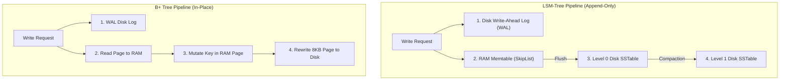

import { BTreeLsmVisualizer } from '../../components/visualizers/BTreeLsmVisualizer';
import { TabbedCodeBlock } from '../../components/ui/TabbedCodeBlock';
import { Callout } from '../../components/ui/Callout';

export const storageEngineSnippets = {
  cpp: {
    label: 'C++20 (B+ Tree Page)',
    ext: 'cpp',
    lang: 'cpp',
    filename: 'btree_page.cpp',
    code: `#include <cstdint>
#include <array>

// 4KB Aligned B+ Tree Page Node
#pragma pack(push, 1)
template <typename KeyType, typename ValueType, size_t PageSize = 4096>
struct BTreePage {
    uint16_t node_type;       // 0 = Internal, 1 = Leaf
    uint16_t num_keys;        // Active key count
    uint32_t right_sibling;   // Right leaf pointer for O(1) range scans
    
    std::array<KeyType, 128> keys;
    std::array<ValueType, 128> values;
};
#pragma pack(pop)`
  },
  rust: {
    label: 'Rust (LSM SSTable Flush)',
    ext: 'rs',
    lang: 'rust',
    filename: 'lsm_sstable.rs',
    code: `use std::collections::BTreeMap;
use std::fs::File;
use std::io::{BufWriter, Write, Result};
use std::path::Path;

pub fn flush_memtable_to_sstable(
    memtable: &BTreeMap<Vec<u8>, Vec<u8>>, 
    sstable_path: &Path
) -> Result<()> {
    let file = File::create(sstable_path)?;
    let mut writer = BufWriter::new(file);

    // Memtable is pre-sorted in RAM -> write sequentially to disk SSTable
    for (key, val) in memtable.iter() {
        writer.write_all(&(key.len() as u32).to_le_bytes())?;
        writer.write_all(key)?;
        writer.write_all(&(val.len() as u32).to_le_bytes())?;
        writer.write_all(val)?;
    }
    writer.flush()?;
    Ok(())
}`
  }
};

When designing production storage engines, software engineers face a fundamental physical constraint: **random disk I/O is orders of magnitude slower and more expensive than sequential disk I/O**.

Whether building a low-latency cache, an analytical columnar warehouse, or an OLTP transactional database, your choice of underlying storage engine architecture dictates read latency, write throughput, write amplification, and recovery overhead.

---

## 1. Summary & Key Architectural Tradeoffs

| Architecture Metric | B+ Tree Storage Engine | LSM-Tree Storage Engine |
| :--- | :--- | :--- |
| **Write Pattern** | In-place random page updates | Sequential append-only WAL & Memtable |
| **Write Amplification** | High (full page rewrite per key update) | Low to Medium (amortized via SSTable compaction) |
| **Read Amplification** | $O(\log_B N)$ single page fetch | Multiple SSTable levels (mitigated by Bloom filters) |
| **Primary Use Cases** | Traditional OLTP, mixed read/write workloads | High-ingest telemetry, time-series, write-heavy workloads |
| **Flagship Engines** | PostgreSQL, MySQL (InnoDB), SQLite | RocksDB, LevelDB, Cassandra, Pebble |

---

## 2. Interactive B+ Tree vs. LSM-Tree Engine Simulation

Test the difference below between B+ Tree page insertions and LSM-Tree append-only Memtable flushes:

<BTreeLsmVisualizer client:load />

---

## 3. Storage Pipeline Comparison

---

## 4. Multi-Language Engine Code Implementation

<TabbedCodeBlock client:load title="Storage Engine Code Comparison" snippets={storageEngineSnippets} defaultFilenamePrefix="storage_engine" />

---

## 5. Architectural Guidance

- Choose **B+ Tree (PostgreSQL / InnoDB)** when your workload is read-heavy, requires multi-key transactions, complex SQL joins, and strict point-lookup SLAs.
- Choose **LSM-Tree (RocksDB / Cassandra)** when your application ingests high-volume telemetry, time-series data, or experiences heavy write throughput.
