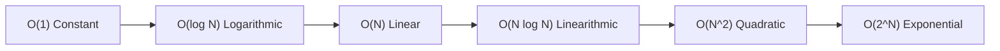

import { BigOComplexityVisualizer } from '../../components/visualizers/BigOComplexityVisualizer';
import { Callout } from '../../components/ui/Callout';

Evaluating algorithmic efficiency requires measuring how **execution time** and **memory consumption** scale as the input size $N$ grows toward infinity. This mathematical framework is known as **Big O Notation** (Asymptotic Complexity).

---

## 1. Summary & Key Takeaways

- **Time Complexity**: Bounds the total number of fundamental operations executed by an algorithm relative to input size $N$.
- **Space Complexity**: Measures auxiliary memory (heap allocations and call stack depth) allocated during execution.
- **Asymptotic Hierarchy (Fastest to Slowest)**:
  1. $O(1)$ - Constant Time (Instant hash map lookup)
  2. $O(\log N)$ - Logarithmic Time (Binary Search)
  3. $O(N)$ - Linear Time (Single array loop traversal)
  4. $O(N \log N)$ - Linearithmic Time (Merge Sort, Quick Sort)
  5. $O(N^2)$ - Quadratic Time (Nested loop comparison)
  6. $O(2^N)$ - Exponential Time (Recursive Fibonacci)

---

## 2. Interactive Algorithmic Complexity Analyzer

Scale input elements $N$ from 10 to 1,000 below to observe how step operations and memory allocations grow across different Big O complexity classes!

<Callout type="tip" title="Big O Experiment">
Adjust the $N$ slider to observe how $O(N^2)$ operation count explodes compared to $O(\log N)$ and $O(N \log N)$!
</Callout>

<BigOComplexityVisualizer client:visible />

---

## 3. Complexity Curve Growth Rates

---

## 4. Complexity Classes Comparison Matrix

| Big O Notation | Growth Category | Operations for $N = 10,000$ | Example Algorithm |
| :--- | :--- | :--- | :--- |
| **$O(1)$** | Constant | **1** | Array index lookup `arr[i]` |
| **$O(\log N)$** | Logarithmic | **13** | Binary Search on sorted array |
| **$O(N)$** | Linear | **10,000** | Unsorted Linear Search |
| **$O(N \log N)$** | Linearithmic | **132,877** | Merge Sort / Heap Sort |
| **$O(N^2)$** | Quadratic | **100,000,000** | Bubble Sort / All-Pairs Matrix |
