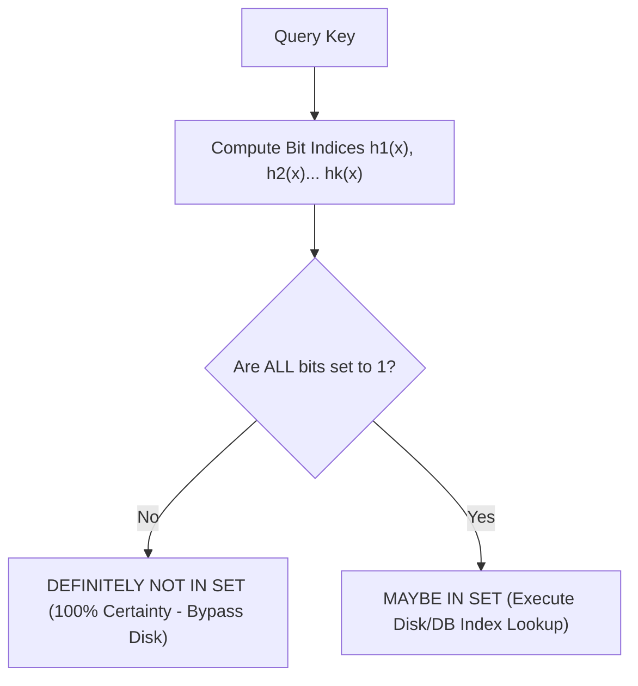

import { BloomFilterVisualizer } from '../../components/visualizers/BloomFilterVisualizer';
import { BloomFilterCodeComparison } from '../../components/visualizers/BloomFilterCodeComparison';
import { Callout } from '../../components/ui/Callout';

When handling billions of key-value lookups in high-throughput databases (like RocksDB, Apache Cassandra, PostgreSQL, and Google Bigtable), checking whether a key exists in disk storage before executing an expensive I/O operation is a major bottleneck.

A **Bloom Filter** is a space-efficient probabilistic data structure invented by Burton Howard Bloom in 1970 that tests set membership in $O(k)$ constant time using a compact bit vector and $k$ independent hash functions.

---

## 1. Summary & Key Takeaways

- **Zero False Negatives**: If the Bloom Filter returns `false` ("Definitely Not in Set"), the element is **guaranteed 100% not to exist**. The system can safely bypass expensive disk lookups!
- **Controlled False Positive Rate ($\epsilon$)**: If the filter returns `true` ("Maybe in Set"), the element might exist, or a hash collision occurred. The false positive probability is bounded mathematically:
  $$\epsilon \approx \left(1 - e^{-kn/m}\right)^k$$
  where $m$ is the bit array size, $n$ is the number of inserted keys, and $k$ is the number of hash functions.
- **Space Efficiency**: Requires only ~10 bits per element for a 1% false positive rate, orders of magnitude smaller than hash sets or B-Trees.

---

## 2. Interactive Bloom Filter Simulator

Insert keys into the 16-bit array below using independent hash functions, and run membership queries to observe **definite negatives**, **true positives**, and **probabilistic false positives**!

<Callout type="tip" title="Bloom Filter Experiment">
Insert multiple keys to set bit positions. Then query a key that was NEVER added to test if it yields a "Definitely Not in Set" or a "False Positive"!
</Callout>

<BloomFilterVisualizer client:visible />

---

## 3. Bloom Filter Query Flowchart

---

## 4. Multi-Language Implementation Code

Compare production Bloom Filter implementations across **C++**, **Python**, **Java**, **Go**, **Rust**, and **TypeScript** below:

<BloomFilterCodeComparison client:visible />

---

## 5. Probabilistic vs Exact Search Structures

| Data Structure | Space per Element | Search Time | False Negative Rate | False Positive Rate | Primary Application |
| :--- | :--- | :--- | :--- | :--- | :--- |
| **Hash Set / Map** | ~32 - 64 Bytes | $O(1)$ | **0%** | **0%** | In-Memory Key Lookup |
| **B-Tree Index** | ~128 Bytes | $O(\log N)$ | **0%** | **0%** | Relational Database Indexes |
| **Bloom Filter** | **~1.2 Bytes (10 bits)** | **$O(k)$** | **0% (Zero)** | ~1% (Configurable) | LSM-Tree / Disk Bypass Filters |
