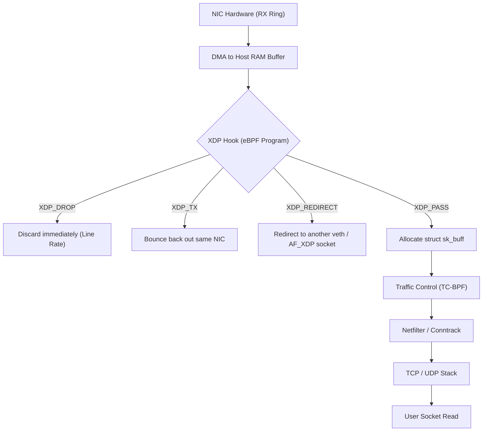

import { TabbedCodeBlock } from '../../components/ui/TabbedCodeBlock';
import { Callout } from '../../components/ui/Callout';

export const xdpSnippets = {
  c: {
    label: 'C (XDP Kernel Program)',
    ext: 'c',
    lang: 'c',
    filename: 'xdp_drop_udp.c',
    code: `#include <linux/bpf.h>
#include <linux/if_ether.h>
#include <linux/ip.h>
#include <linux/udp.h>
#include <bpf/bpf_helpers.h>

SEC("xdp")
int filter_ingress(struct xdp_md *ctx) {
    void *data_end = (void *)(long)ctx->data_end;
    void *data = (void *)(long)ctx->data;

    struct ethhdr *eth = data;
    if ((void *)(eth + 1) > data_end)
        return XDP_PASS;

    if (eth->h_proto != __constant_htons(ETH_P_IP))
        return XDP_PASS;

    struct iphdr *ip = (void *)(eth + 1);
    if ((void *)(ip + 1) > data_end)
        return XDP_PASS;

    if (ip->protocol == IPPROTO_UDP) {
        struct udphdr *udp = (void *)(ip + 1);
        if ((void *)(udp + 1) > data_end)
            return XDP_PASS;

        if (udp->dest == __constant_htons(53))
            return XDP_DROP;
    }

    return XDP_PASS;
}

char _license[] SEC("license") = "GPL";`
  },
  go: {
    label: 'Go (Cilium eBPF Loader)',
    ext: 'go',
    lang: 'go',
    filename: 'loader.go',
    code: `package main

import (
	"log"
	"net"

	"github.com/cilium/ebpf/link"
)

func main() {
	objs := xdpObjects{}
	if err := loadXdpObjects(&objs, nil); err != nil {
		log.Fatalf("loading objects: %v", err)
	}
	defer objs.Close()

	iface, err := net.InterfaceByName("eth0")
	if err != nil {
		log.Fatalf("lookup eth0: %v", err)
	}

	l, err := link.AttachXDP(link.XDPOptions{
		Program:   objs.FilterIngress,
		Interface: iface.Index,
		Flags:     link.XDPGenericMode,
	})
	if err != nil {
		log.Fatalf("attaching XDP: %v", err)
	}
	defer l.Close()

	log.Println("XDP filter active on eth0. Dropping UDP/53...")
	select {}
}`
  }
};

In standard Linux network stacks, every incoming packet received by a network interface card (NIC) triggers an interrupt. The kernel allocates a complex socket buffer structure (`struct sk_buff`), pushes it through netfilter, connection tracking (`conntrack`), IP routing, and finally copies the payload across the user-kernel boundary into socket queues.

When defending against volumetric Distributed Denial of Service (DDoS) attacks or building ultra-low-latency gateways, this pipeline collapses under CPU overhead: `sk_buff` allocations and cache misses cap packet processing around 1 to 2 million packets per second (Mpps) per CPU core.

**eXpress Data Path (XDP)**, combined with **extended Berkeley Packet Filter (eBPF)**, radically changes this paradigm. It enables executing verified, safe bytecode directly inside the NIC driver or firmware, before memory allocation or stack traversal occurs.

---

## 1. Summary & Core Architecture

| Metric | Traditional Linux Stack (`netfilter` / `iptables`) | eBPF / XDP In-Driver Hook |
| :--- | :--- | :--- |
| **Execution Point** | After `sk_buff` allocation & TCP/IP stack traversal | Directly inside driver receive ring buffer (RX ring) |
| **Throughput (1 Core)** | ~1.5 - 2.5 Mpps | 15 - 24 Mpps (Driver), >40 Mpps (Hardware Offload) |
| **Memory Allocation** | Heap allocation per packet (`struct sk_buff`) | Zero allocation (`xdp_buff` points to raw frame) |
| **Safety Guarantee** | Kernel module crashes whole OS on memory faults | Static in-kernel verifier guarantees bounds and safety |
| **Primary Use Cases** | General host networking, stateful firewalls | DDoS mitigation (Cloudflare), L4 load balancing (Cilium, Katran) |

---

## 2. Ingress Packet Flow Pipeline

---

## 3. XDP Action Return Codes

XDP programs return one of five deterministic integer action codes:

1. **`XDP_DROP`**: Instructs the NIC driver to instantly recycle the packet memory page back to the RX descriptor ring. Zero memory allocation, zero CPU cache pollution.
2. **`XDP_TX`**: Bounces the packet back out the same network interface that received it, typically after modifying the Layer 2/3 headers (used for stateless Direct Server Return load balancers like Meta Katran).
3. **`XDP_REDIRECT`**: Bypasses the host stack and forwards the frame directly to another network interface, a veth pair (container networking), or directly to an `AF_XDP` userspace ring buffer.
4. **`XDP_PASS`**: Hands the packet off to the regular Linux network stack by allocating an `sk_buff`.
5. **`XDP_ABORTED`**: Indicates an eBPF program error; drops the packet and increments an error tracepoint.

---

## 4. The eBPF Static Verifier Contract

Before any eBPF program can be loaded into the Linux kernel via the `bpf()` system call, it must satisfy the kernel verifier:

- **Strict Pointer Bounds Checking**: Accessing `ctx->data + offset` without first checking if `(ptr + sizeof(type)) <= ctx->data_end` results in immediate rejection: `invalid access to packet, misaligned or out of bounds`.
- **Termination Proof**: The verifier constructs a Directed Acyclic Graph (DAG) of all possible execution branches. Backward jumps are only allowed with verifiable loop counters bounded to fixed iterations.
- **Forbidden Unsafe Calls**: Arbitrary memory dereferencing, unbounded pointer arithmetic, and uninitialized stack variable reads are blocked.

<Callout type="warning" title="Verifier Boundary Enforcement">
In the C kernel snippet above, every pointer dereference requires an explicit check against <code>ctx-&gt;data_end</code>. Omitting a single boundary check causes the Linux verifier to reject the object file during system call loading.
</Callout>

---

## 5. Dual-Language Implementation

<TabbedCodeBlock client:load title="eBPF / XDP Driver Filter & Go Loader" snippets={xdpSnippets} defaultFilenamePrefix="xdp_filter" />

---

## 6. Architectural Guidance

- Use **XDP Driver Mode** when building high-volume L4 load balancers, anti-DDoS scrubbing proxies, or container networking meshes (such as Cilium).
- Use **TC-BPF (Traffic Control)** when packet inspection requires egress shaping, fragmented packet reassembly, or integration with socket-level metadata.
- Use **`AF_XDP` Zero-Copy Sockets** when userspace applications need raw packet streams without the hardware lock-in of proprietary kernel-bypass SDKs.
