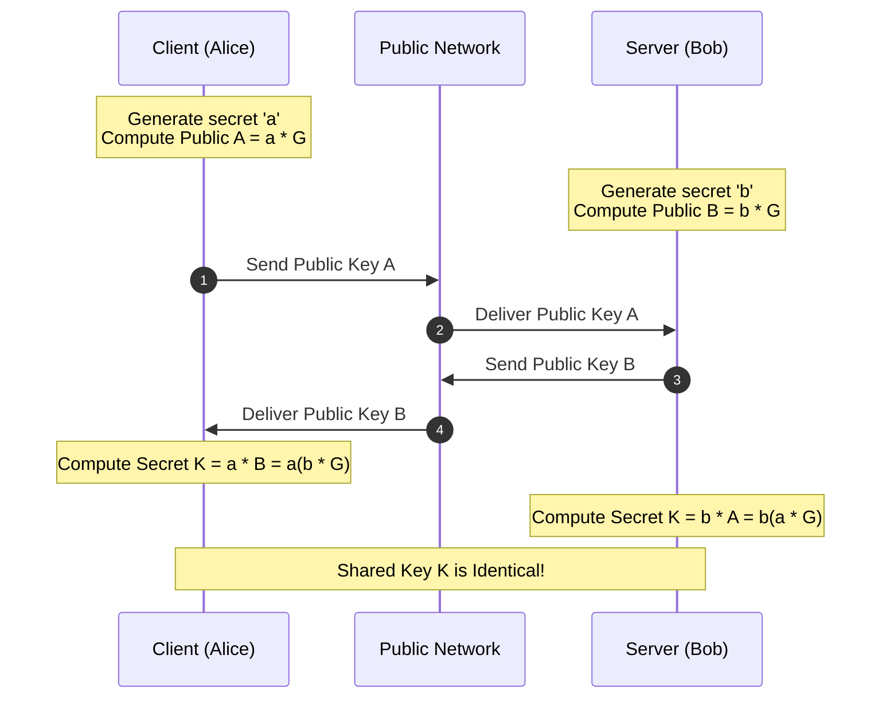

import { EccVisualizer } from '../../components/visualizers/EccVisualizer';
import { TabbedCodeBlock } from '../../components/ui/TabbedCodeBlock';
import { Callout } from '../../components/ui/Callout';

export const eccSnippets = {
  cpp: {
    label: 'C++20 (Double-and-Add)',
    ext: 'cpp',
    lang: 'cpp',
    filename: 'ecc_dh.cpp',
    code: `#include <iostream>
#include <cstdint>

struct Point {
    uint64_t x;
    uint64_t y;
    bool is_null;
};

uint64_t modInverse(uint64_t a, uint64_t m);

Point pointAdd(const Point& P, const Point& Q, uint64_t a, uint64_t p) {
    if (P.is_null) return Q;
    if (Q.is_null) return P;

    uint64_t lambda;
    if (P.x == Q.x && P.y == Q.y) {
        // Point Doubling: lambda = (3*x1^2 + a) / (2*y1) mod p
        uint64_t num = (3 * P.x * P.x + a) % p;
        uint64_t den = modInverse(2 * P.y, p);
        lambda = (num * den) % p;
    } else {
        // Point Addition: lambda = (y2 - y1) / (x2 - x1) mod p
        uint64_t num = (Q.y + p - P.y) % p;
        uint64_t den = modInverse((Q.x + p - P.x) % p, p);
        lambda = (num * den) % p;
    }

    uint64_t x3 = (lambda * lambda + p - P.x + p - Q.x) % p;
    uint64_t y3 = (lambda * (P.x + p - x3) + p - P.y) % p;
    return { x3, y3, false };
}

Point scalarMultiply(uint64_t k, Point P, uint64_t a, uint64_t p) {
    Point R = { 0, 0, true }; // Point at infinity
    while (k > 0) {
        if (k & 1) R = pointAdd(R, P, a, p);
        P = pointAdd(P, P, a, p);
        k >>= 1;
    }
    return R;
}`
  },
  python: {
    label: 'Python (Cryptography Lib)',
    ext: 'py',
    lang: 'python',
    filename: 'ecdh_exchange.py',
    code: `from cryptography.hazmat.primitives.asymmetric import ec
from cryptography.hazmat.primitives import serialization

# 1. Alice generates ECDH keypair using Curve25519 / SECP256R1
alice_private_key = ec.generate_private_key(ec.SECP256R1())
alice_public_key = alice_private_key.public_key()

# 2. Bob generates ECDH keypair
bob_private_key = ec.generate_private_key(ec.SECP256R1())
bob_public_key = bob_private_key.public_key()

# 3. Derive identical shared symmetric key
alice_shared_key = alice_private_key.exchange(ec.ECDH(), bob_public_key)
bob_shared_key = bob_private_key.exchange(ec.ECDH(), alice_public_key)

assert alice_shared_key == bob_shared_key
print(f"Shared Key Established ({len(alice_shared_key)} bytes)!")`
  }
};

Modern internet security relies heavily on public-key cryptography. Traditional RSA key exchange relies on the difficulty of factoring large composite integers ($N = p \cdot q$). However, as supercomputers advance, RSA requires impractically large keys ($3072$-bit or $4096$-bit) to maintain security.

**Elliptic Curve Cryptography (ECC)** offers equivalent cryptographic security with dramatically smaller key sizes  -  a $256$-bit ECC key delivers the same security strength as a $3072$-bit RSA key!

---

## 1. Summary & Key Takeaways

- **Weierstrass Curve Equation**: $y^2 \equiv x^3 + a x + b \pmod p$.
- **Geometric Point Addition**: Draw a line through $P$ and $Q$, intersect the curve at a 3rd point, and reflect across the x-axis ($P + Q = R$).
- **ECDH Security**: Based on the **Elliptic Curve Discrete Logarithm Problem (ECDLP)**.

---

## 2. Interactive ECDH Key Exchange Simulator

Test how Alice and Bob generate identical shared secrets without transmitting their private keys:

<EccVisualizer client:load />

---

## 3. ECDH Protocol Sequence Diagram

---

## 4. Multi-Language Cryptography Code Implementation

<TabbedCodeBlock client:load title="ECDH Point Multiplication Code" snippets={eccSnippets} defaultFilenamePrefix="ecc_crypto" />

---

## 5. Security & Performance Invariants

1. **Smaller Keys**: A 256-bit ECC key provides 128-bit symmetric security equivalence (matching 3072-bit RSA).
2. **TLS 1.3 Adoption**: ECDHE (Elliptic Curve Diffie-Hellman Ephemeral) is mandatory in TLS 1.3 for perfect forward secrecy.
