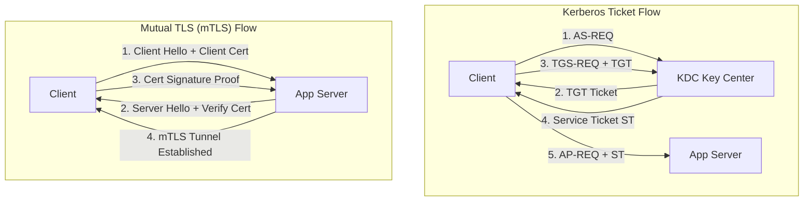

import { EnterpriseAuthVisualizer } from '../../components/visualizers/EnterpriseAuthVisualizer';
import { Callout } from '../../components/ui/Callout';

Securing enterprise networks and modern microservice architectures requires choosing between legacy domain authentication (**NTLM**), Ticket-Granting Active Directory protocols (**Kerberos / SPNEGO**), and cryptographic zero-trust PKI architectures (**Mutual TLS / mTLS**).

---

## 1. Summary & Key Takeaways

- **NTLM (NT LAN Manager)**: Legacy challenge-response protocol. Susceptible to **NTLM Relay attacks** and Pass-the-Hash vulnerabilities because it verifies password hashes directly rather than issuing tickets.
- **Kerberos & SPNEGO**: Uses a trusted third party - the **Key Distribution Center (KDC)** - to issue encrypted **Ticket Granting Tickets (TGT)** and **Service Tickets (ST)**. Eliminates sending password hashes across the wire.
- **SPNEGO (Simple and Protected GSSAPI Negotiation Mechanism)**: A wrapper protocol that allows client and server to negotiate whether to use Kerberos or fall back to NTLM over HTTP headers (`Authorization: Negotiate`).
- **Mutual TLS (mTLS)**: Zero-trust network protocol authentication. Both client and server present X.509 Digital Certificates signed by a trusted Enterprise Certificate Authority (CA) during the TLS handshake, authenticating both endpoints cryptographically before any application data is sent.

---

## 2. Interactive Protocol Handshake Simulator

Step through the handshake sequence below to compare **Kerberos/SPNEGO**, **NTLM Challenge-Response**, and **Mutual TLS (mTLS)**!

<Callout type="tip" title="Protocol Handshake Experiment">
Select Kerberos or Mutual TLS (mTLS) and click "Next Step" to trace how tickets or PKI certificates authenticate clients and servers without transmitting passwords over the wire!
</Callout>

<EnterpriseAuthVisualizer client:visible />

---

## 3. Protocol Flow Comparison

---

## 4. Authentication Method Matrix

| Protocol | Architecture | Verification Credential | Password Transmitted? | Primary Use Case |
| :--- | :--- | :--- | :--- | :--- |
| **NTLM** | Challenge-Response | Hash Response (TYPE 3) | Hash Response Sent | Legacy Windows Domains |
| **Kerberos / SPNEGO** | KDC Ticket Based | TGT & Service Tickets | **Never** | Active Directory Domains |
| **Mutual TLS (mTLS)** | PKI Certificate Based | X.509 Client Cert & RSA Sign | **Never** | Zero-Trust Microservices |
