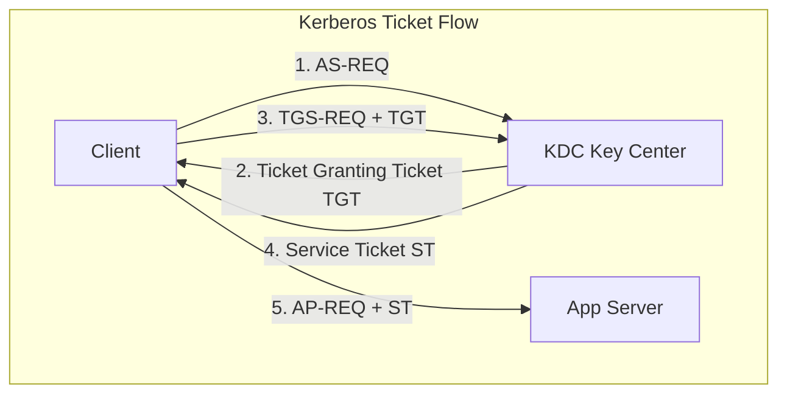

import { EnterpriseAuthVisualizer } from '../../components/visualizers/EnterpriseAuthVisualizer';
import { Callout } from '../../components/ui/Callout';

Securing enterprise networks and modern cloud APIs requires choosing between legacy domain authentication (**NTLM**), Ticket-Granting Active Directory protocols (**Kerberos / SPNEGO**), and stateless token architectures (**JWT & HTTP-Only Cookies**).

---

## 1. Summary & Key Takeaways

- **NTLM (NT LAN Manager)**: Legacy challenge-response protocol. Susceptible to **NTLM Relay attacks** and Pass-the-Hash vulnerabilities because it verifies password hashes directly rather than issuing tickets.
- **Kerberos & SPNEGO**: Uses a trusted third party - the **Key Distribution Center (KDC)** - to issue encrypted **Ticket Granting Tickets (TGT)** and **Service Tickets (ST)**. Eliminates sending password hashes across the wire.
- **SPNEGO (Simple and Protected GSSAPI Negotiation Mechanism)**: A wrapper protocol that allows client and server to negotiate whether to use Kerberos or fall back to NTLM over HTTP headers (`Authorization: Negotiate`).
- **JWT & HTTP-Only Cookies**: Modern web/API stateless authentication. Cryptographically signed payload (HMAC-SHA256 or RS256) stored in `SameSite=Strict` HTTP-only cookies to mitigate XSS and CSRF attacks.

---

## 2. Interactive Handshake Step Simulator

Step through the handshake sequence below to compare **Kerberos/SPNEGO**, **NTLM Challenge-Response**, and **JWT Stateless Verification**!

<Callout type="tip" title="Protocol Handshake Experiment">
Select Kerberos and click "Next Step" to trace how the Key Distribution Center issues TGT and Service Tickets before client connects to the target server.
</Callout>

<EnterpriseAuthVisualizer client:visible />

---

## 3. Protocol Flow Comparison

---

## 4. Authentication Method Matrix

| Protocol | Architecture | Ticket / Token Type | Password Transmitted? | Primary Vulnerability |
| :--- | :--- | :--- | :--- | :--- |
| **NTLM** | Challenge-Response | Hash Response (TYPE 3) | Hash Response Sent | NTLM Relay / Pass-the-Hash |
| **Kerberos** | KDC Ticket Based | TGT & Service Tickets | **Never** | Kerberoasting / Ticket Forgery |
| **JWT & Cookies** | Stateless Cryptographic | Signed Base64 JSON | **Never** (TLS Login Only) | Secret Key Compromise / XSS |
