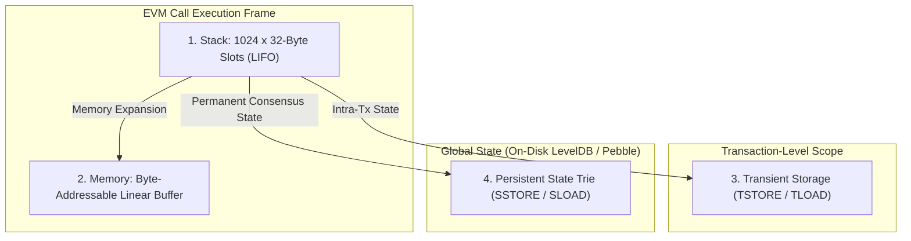

import { TabbedCodeBlock } from '../../components/ui/TabbedCodeBlock';
import { Callout } from '../../components/ui/Callout';

export const evmSnippets = {
  rust: {
    label: 'Rust (EVM Stack & Gas Step Interpreter)',
    ext: 'rs',
    lang: 'rust',
    filename: 'evm_core.rs',
    code: `pub struct EvmStack {
    data: Vec<[u8; 32]>,
}

impl EvmStack {
    pub fn new() -> Self {
        Self { data: Vec::with_capacity(1024) }
    }

    pub fn push(&mut self, val: [u8; 32]) -> Result<(), &'static str> {
        if self.data.len() >= 1024 {
            return Err("StackOverflow");
        }
        self.data.push(val);
        Ok(())
    }

    pub fn pop(&mut self) -> Result<[u8; 32], &'static str> {
        self.data.pop().ok_or("StackUnderflow")
    }
}

pub struct EvmInterpreter {
    pub gas_remaining: u64,
    pub stack: EvmStack,
}

impl EvmInterpreter {
    pub fn step(&mut self, opcode: u8) -> Result<(), &'static str> {
        match opcode {
            0x01 => { // ADD
                if self.gas_remaining < 3 { return Err("OutOfGas"); }
                self.gas_remaining -= 3;
                let a = self.stack.pop()?;
                let b = self.stack.pop()?;
                // 256-bit wrapping addition
                let mut res = [0u8; 32];
                let mut carry = 0u16;
                for i in (0..32).rev() {
                    let sum = (a[i] as u16) + (b[i] as u16) + carry;
                    res[i] = (sum & 0xFF) as u8;
                    carry = sum >> 8;
                }
                self.stack.push(res)?;
            }
            _ => return Err("UnknownOpcode"),
        }
        Ok(())
    }
}`
  },
  solidity: {
    label: 'Solidity (EIP-1153 Transient Reentrancy Guard)',
    ext: 'sol',
    lang: 'solidity',
    filename: 'TransientGuard.sol',
    code: `// SPDX-License-Identifier: MIT
pragma solidity ^0.8.24;

contract TransientReentrancyGuard {
    // Arbitrary storage slot for transient reentrancy status
    bytes32 private constant REENTRANCY_SLOT = 
        keccak256("subroutine.transient.reentrancy.guard");

    modifier nonReentrant() {
        assembly {
            // Check transient slot (costs only 100 gas via TLOAD vs 2100 gas for SLOAD)
            if tload(REENTRANCY_SLOT) {
                revert(0, 0)
            }
            // Set flag in transient memory
            tstore(REENTRANCY_SLOT, 1)
        }
        _;
        assembly {
            // Clear flag before transaction exit (automatic reset at tx end)
            tstore(REENTRANCY_SLOT, 0)
        }
    }

    function executeSwap() external nonReentrant {
        // Safe from reentrancy with near-zero gas overhead
    }
}`
  }
};

The **Ethereum Virtual Machine (EVM)** is a quasi-Turing-complete, deterministic state machine that forms the consensus execution layer of the Ethereum blockchain.

Unlike register-based architectures (x86_64, ARM64, and WebAssembly) or byte-oriented virtual machines, the EVM natively computes on **256-bit integer words**. This choice was deliberately made to facilitate native 256-bit cryptographic operations (Keccak-256 hashes, secp256k1 elliptic curve signatures) without multiple arithmetic dispatch cycles.

---

## 1. Summary & Virtual Machine Architecture

| Memory Component | Persistence | Read / Write Cost | Addressing / Sizing |
| :--- | :--- | :--- | :--- |
| **Stack** | Call frame local | 3 gas per `PUSH` / `POP` | Max 1024 slots of 256-bit words |
| **Volatile Memory** | Message call lifetime | Linear + quadratic expansion | Byte-addressable, zeroed per call |
| **Transient Storage (EIP-1153)** | Transaction lifetime | 100 gas flat (`TLOAD` / `TSTORE`) | 256-bit key-value mapping in RAM |
| **Persistent Storage** | Permanent on-chain | 2,100 to 20,000 gas (`SLOAD` / `SSTORE`) | 256-bit key-value slots (Patricia Trie) |
| **Calldata** | Read-only input | 4 gas (zero byte) / 16 gas (non-zero) | Byte-addressable transaction payload |

---

## 2. The Four EVM Storage Domains

---

## 3. Dynamic Gas Scheduling & Memory Expansion

To solve the Halting Problem, the EVM attaches an atomic resource budget to every transaction: **Gas**. Every bytecode instruction consumes a deterministic amount of gas. If gas drops below zero, the entire transaction reverts, undoing all state mutations while still consuming the transaction fee.

### Memory Expansion Quadratic Cost Function

Volatile EVM memory expands dynamically in 32-byte word increments. The cumulative gas cost $C_{\text{mem}}(a)$ for allocating $a$ words of memory is non-linear:

$$C_{\text{mem}}(a) = 3a + \left\lfloor \frac{a^2}{512} \right\rfloor$$

When expanding memory from $a$ words to $b$ words, the transaction pays:

$$\Delta C = C_{\text{mem}}(b) - C_{\text{mem}}(a)$$

The quadratic term prevents adversarial contracts from flooding validator RAM with unbounded dynamic allocations.

---

## 4. EIP-1153: Transient Storage (`TLOAD` & `TSTORE`)

Historically, smart contracts needing temporary state across multiple internal calls within a single transaction (e.g. reentrancy guards, ERC-20 permit approvals, tick caches in Uniswap v4) had to write to persistent storage via `SSTORE`.

Writing to persistent storage requires disk modification logs and state trie dirtying, costing **2,100 to 20,000 gas** per update.

**EIP-1153 (Cancun Hard Fork)** introduced two new opcodes:
- **`TSTORE (0x5d)`**: Writes a 32-byte value to transient storage. Cost: **100 gas**.
- **`TLOAD (0x5c)`**: Reads a 32-byte value from transient storage. Cost: **100 gas**.

Transient storage is stored in validator RAM and discarded the exact instant the root transaction finishes, eliminating disk I/O and reducing reentrancy protection overhead by over **95%**.

<Callout type="tip" title="Transient Storage Reentrancy Defense">
Using <code>TSTORE</code> and <code>TLOAD</code> for non-reentrant function modifiers avoids polluting the global Ethereum state trie, reducing reentrancy guard gas consumption from over 2,200 gas down to exactly 200 gas per invocation.
</Callout>

---

## 5. Dual-Language Implementation

<TabbedCodeBlock client:load title="EVM Stack Interpreter & Transient Storage Guard" snippets={evmSnippets} defaultFilenamePrefix="evm_pipeline" />

---

## 6. Architectural Guidance

- For temporary intra-transaction state passing (such as Flash Loan accounting or routing reentrancy checks), migrate from persistent storage to **EIP-1153 `TSTORE` / `TLOAD`**.
- Keep memory expansion tight: reading or copying calldata at high offsets triggers the quadratic expansion formula, resulting in sudden out-of-gas failures on large payloads.
- Always use `PUSH0` (EIP-3855) instead of `PUSH1 0x00` to save 1 byte of code size and 1 unit of gas on zero-pushes.
