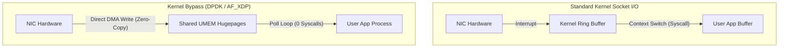

import { KernelBypassVisualizer } from '../../components/visualizers/KernelBypassVisualizer';
import { Callout } from '../../components/ui/Callout';

In ultra-high-performance systems - such as high-frequency trading (HFT) platforms, database storage engines, and web proxy servers - traditional Linux POSIX socket calls (`read()`, `write()`, `send()`, `recv()`) become a major bottleneck due to constant **CPU context switching** and **memory copying**.

Modern high-performance networking bypasses the OS kernel bottleneck using **io_uring** and **DPDK (Data Plane Development Kit)**.

---

## 1. Summary & Key Takeaways

- **Traditional POSIX Syscall Bottleneck**: Every `send()` call forces a CPU transition from Ring 3 (User Space) to Ring 0 (Kernel Space), copying data from user buffers into kernel socket buffers before sending to the NIC.
- **Linux `io_uring`**: Uses a pair of lock-free circular ring buffers - a **Submission Queue (SQ)** and a **Completion Queue (CQ)** - shared directly between user space and the kernel.
- **Kernel Bypass (DPDK)**: Moves Network Interface Card (NIC) drivers directly into user-space applications, bypassing the Linux network stack completely via Direct Memory Access (DMA).
- **MSG_ZEROCOPY**: Instructs the kernel DMA engine to stream data directly from user memory buffers without copying.

---

## 2. Interactive Zero-Copy Simulator

Use the interactive benchmark tool below to compare traditional **POSIX Socket Syscalls** against **Linux io_uring Zero-Copy Ring Buffers**!

<Callout type="tip" title="Network Benchmark Experiment">
Run <strong>POSIX Syscall</strong> and watch the context switch counter jump to 100! Then switch to <strong>io_uring Zero-Copy Ring</strong> to see 0 context switches and 0 memory copies.
</Callout>

<KernelBypassVisualizer client:visible />

---

## 3. High-Performance Architecture Comparison

---

## 4. Networking Model Comparison Matrix

| Technology | Context Switch Cost | Data Copies | Primary Use Case |
| :--- | :--- | :--- | :--- |
| **POSIX Syscalls (`recv`/`send`)** | High (~1,000 CPU cycles / call) | 2 Copies (User $\rightarrow$ Kernel $\rightarrow$ NIC) | Standard web servers |
| **Linux `io_uring`** | **Zero** (Batched / Polled ring) | **Zero** (`MSG_ZEROCOPY`) | High-concurrency servers & DBs |
| **DPDK (Kernel Bypass)** | **Zero** (User-space NIC polling) | **Zero** (Direct DMA) | HFT trading & packet routers |
