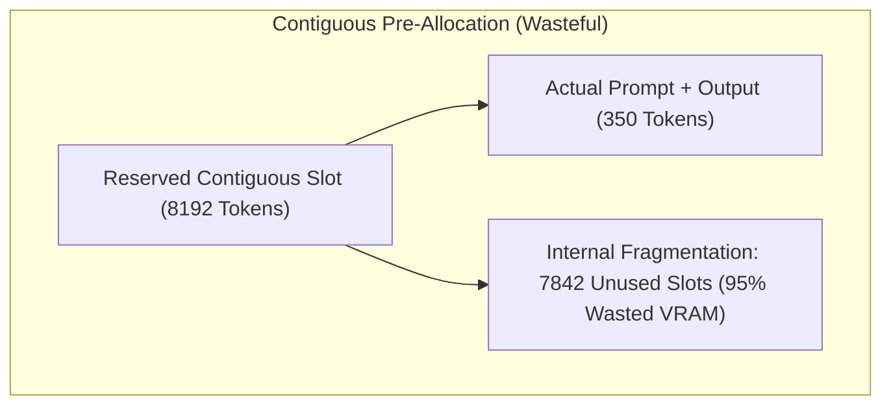
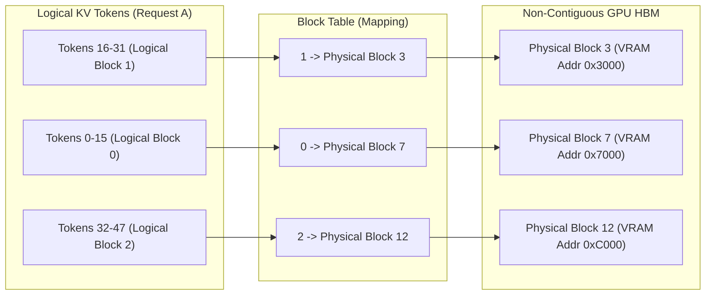

import { TabbedCodeBlock } from '../../components/ui/TabbedCodeBlock';
import { Callout } from '../../components/ui/Callout';

export const pagedSnippets = {
  python: {
    label: 'Python (Block Table Allocator)',
    ext: 'py',
    lang: 'python',
    filename: 'block_manager.py',
    code: `class PhysicalBlock:
    def __init__(self, block_number: int, block_size: int):
        self.block_number = block_number
        self.block_size = block_size
        self.ref_count = 0

class BlockManager:
    def __init__(self, num_blocks: int, block_size: int = 16):
        self.block_size = block_size
        self.free_blocks = [PhysicalBlock(i, block_size) for i in range(num_blocks)]
        self.block_tables = {}

    def allocate(self, seq_id: str, prompt_tokens: int):
        needed_blocks = (prompt_tokens + self.block_size - 1) // self.block_size
        table = []
        for _ in range(needed_blocks):
            block = self.free_blocks.pop(0)
            block.ref_count = 1
            table.append(block)
        self.block_tables[seq_id] = table

    def append_token(self, seq_id: str, current_len: int):
        table = self.block_tables[seq_id]
        if current_len % self.block_size == 0:
            new_block = self.free_blocks.pop(0)
            new_block.ref_count = 1
            table.append(new_block)`
  },
  pytorch: {
    label: 'PyTorch (Paged Attention Lookup)',
    ext: 'py',
    lang: 'python',
    filename: 'paged_attention.py',
    code: `import torch

def paged_kv_gather(key_cache, block_table, seq_lens, block_size=16):
    batch_size = len(seq_lens)
    gathered_keys = []
    for i in range(batch_size):
        blocks = block_table[i]
        length = seq_lens[i]
        seq_blocks = []
        for b_idx in blocks:
            seq_blocks.append(key_cache[b_idx])
        full_tensor = torch.cat(seq_blocks, dim=1)
        gathered_keys.append(full_tensor[:, :length, :])
    return gathered_keys`
  }
};

In autoregressive Large Language Model (LLM) serving, inference occurs in two distinct phases:
1. **Prefill Phase**: Computes embeddings and initial key/value states for all prompt tokens in parallel.
2. **Decode Phase**: Generates tokens sequentially, one by one. Generating token $t$ requires attending to the representations of all previous tokens $1 \dots t-1$.

To avoid recalculating self-attention keys and values on every forward pass, systems retain intermediate states in high-bandwidth GPU memory (HBM) as the **Key-Value (KV) Cache**.

However, managing the KV-cache is the dominant operational bottleneck in modern production LLM serving, frequently bottlenecking concurrency and batch size before GPU compute capacity is saturated.

---

## 1. The GPU Memory Crisis: Cache Growth & Fragmentation

For a model with $L$ layers, $H$ attention heads, and head dimension $D$, storing FP16 keys and values for a single token requires:

$$\text{Bytes per Token} = 2 \times 2 \times L \times H \times D$$

For Llama-3-70B with 80 layers, 64 heads, and $D = 128$:

$$\text{Size per Token} = 4 \times 80 \times 64 \times 128 = 2.62 \text{ MB per token}$$

A single conversation holding a 4,096 context window consumes **10.7 GB of GPU memory** solely for its KV-cache.

### Traditional Pre-Allocation Bottleneck

Historically, inference runtimes pre-allocated a contiguous tensor for each request sized to the maximum possible sequence length (`max_seq_len` = 4096 or 8192):

Across variable-length concurrent requests, this produced catastrophic memory waste:
- **Internal Fragmentation**: Memory reserved for the worst-case output length remained allocated but completely unused.
- **External Fragmentation**: Free memory was scattered in non-contiguous gaps, rejecting incoming requests even when aggregate free VRAM was plentiful.
- Real-world GPU memory utilization rarely exceeded **20% to 40%**.

---

## 2. PagedAttention: Operating System Virtual Memory for GPUs

Introduced by Woosuk Kwon et al. in the **vLLM** project, **PagedAttention** adapts the classical operating system concept of **Paging and Virtual Memory** directly to GPU tensors.

Rather than storing each request's KV-cache in contiguous physical GPU memory, PagedAttention partitions the cache into fixed-size physical blocks (typically holding 16 or 32 tokens).

### Architectural Advantages

| Metric | Contiguous KV-Cache Allocation | PagedAttention Architecture |
| :--- | :--- | :--- |
| **Allocation Strategy** | Static pre-allocation up to `max_seq_len` | On-demand dynamic block allocation (16 tokens/block) |
| **Internal Fragmentation** | Severe (up to 80% wasted memory per request) | Confined to the single active final block (under 4%) |
| **External Fragmentation** | Frequent due to non-contiguous free memory chunks | Zero (any free block can satisfy any request) |
| **Effective Batch Size** | Low (bounded by peak memory reservation) | 2x to 4x higher throughput on identical hardware |
| **Branching Support** | Full tensor clone required | Instant Copy-On-Write via reference counting |

---

## 3. Copy-on-Write and Parallel Sampling

In advanced decoding strategies like beam search, parallel generation, and tree-of-thought exploration, multiple candidate outputs share identical prompt tokens.

With PagedAttention, branched candidate requests share the exact same physical block pointers in their respective block tables, incrementing a `ref_count`.

Only when a specific branch appends a unique token that mutates an existing block does PagedAttention allocate a new block and perform a **Copy-on-Write (CoW)** clone:

$$\text{Memory Overhead (Beam Search)} \approx \text{Prompt Blocks} + K \times \text{Generation Blocks}$$

<Callout type="tip" title="Prefix Caching">
PagedAttention enables cross-request prefix caching. Common system prompts (such as long context rules or corporate guidelines) are computed once, stored in permanent physical blocks, and shared across all incoming user sessions without re-computation or duplicate VRAM usage.
</Callout>

---

## 4. Dual-Language Implementation

<TabbedCodeBlock client:load title="Paged KV-Cache Block Management" snippets={pagedSnippets} defaultFilenamePrefix="paged_attention" />

---

## 5. Architectural Guidance

- When deploying LLM services on dedicated GPU clusters (Nvidia H100, A100, L40S), prioritize engines utilizing PagedAttention (vLLM, TGI, TensorRT-LLM) over naive HuggingFace pipeline wrappers.
- Tune `block_size` based on average sequence length: smaller block sizes (8 or 16) minimize residual tail waste for short prompts, while larger blocks (32 or 64) maximize CUDA memory bus coalescing efficiency during attention kernel execution.
