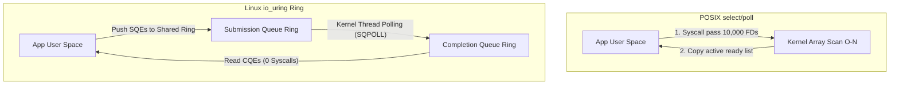

import { EpollIoUringVisualizer } from '../../components/visualizers/EpollIoUringVisualizer';
import { Callout } from '../../components/ui/Callout';

Building web servers, high-concurrency proxies (like Nginx, HAProxy, and Envoy), or async runtimes (Node.js, Tokio, and libuv) requires handling tens of thousands of concurrent open socket connections (the **C10K / C1000K problem**).

Over the last 25 years, Linux async I/O has evolved through three distinct paradigms: **`select` / `poll`**, **`epoll`**, and **`io_uring`**.

---

## 1. Summary & Key Takeaways

- **POSIX `select()` / `poll()` Bottleneck**: Scans the entire file descriptor array linearly ($O(N)$) on every loop iteration. With 10,000 open sockets, inspecting 5 active sockets forces 10,000 array checks in the kernel.
- **Linux `epoll` ($O(1)$)**: Uses an in-kernel **Red-Black Tree** to track open sockets and a **Ready List** populated by NIC interrupts. Calling `epoll_wait()` returns *only* active file descriptors in $O(1)$ time.
- **Linux `io_uring`**: Eliminates kernel context switch overhead entirely! Uses a pair of lock-free circular ring buffers - a **Submission Queue (SQ)** and a **Completion Queue (CQ)** - shared directly between user space and the kernel via mapped memory.
- **Zero-Syscall Mode (`IORING_SETUP_SQPOLL`)**: A kernel thread polls the Submission Queue directly, allowing user applications to submit read/write I/O requests with **zero system calls**.

---

## 2. Interactive Async I/O & Event Loop Benchmark

Simulate workload performance below with up to **10,000 concurrent sockets** across **POSIX `select`**, **Linux `epoll`**, and **`io_uring`**!

<Callout type="tip" title="Async I/O Experiment">
Scale connection count to 10,000 sockets. Watch `select` flood the CPU with syscalls, `epoll` reduce overhead to active sockets, and `io_uring` process batch events with 0 system calls!
</Callout>

<EpollIoUringVisualizer client:visible />

---

## 3. Kernel Architecture Comparison

---

## 4. Async I/O Protocol Matrix

| Interface | Time Complexity | Kernel Copy per Loop | Syscalls per I/O | Max Concurrency |
| :--- | :--- | :--- | :--- | :--- |
| **`select()`** | $O(N)$ Linear | Copy full FD set | 1 per loop iteration | 1,024 (`FD_SETSIZE`) |
| **`poll()`** | $O(N)$ Linear | Copy array of `pollfd` | 1 per loop iteration | Unlimited (RAM bounded) |
| **`epoll()`** | **$O(1)$ Constant** | None (Red-Black Tree) | 1 per batch (`epoll_wait`) | Millions |
| **`io_uring`** | **$O(1)$ Constant** | **Zero** (Shared Mapped Ring) | **Zero** (`SQPOLL` mode) | Millions |
