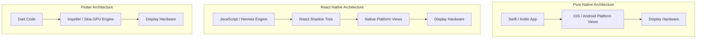

import { NativeVsHybridStackVisualizer } from '../../components/visualizers/NativeVsHybridStackVisualizer';
import { Callout } from '../../components/ui/Callout';

When engineering high-scale mobile applications, developers face a core architectural choice: build pure **Native apps** (using Swift for iOS and Kotlin for Android) or adopt **Hybrid Cross-Platform frameworks** (such as React Native or Flutter).

While hybrid frameworks accelerate feature delivery with single-codebase development, they introduce runtime abstractions and performance trade-offs.

---

## 1. Summary & Key Takeaways

- **Pure Native (Swift / Kotlin)**: Compiles directly into native **ARM64 machine instructions**. Zero bridge or thread-marshalling overhead. Provides direct access to Metal/Vulkan GPU APIs and lowest RAM overhead (~35MB baseline).
- **React Native (JavaScript Interface / JSI)**: Runs JavaScript code inside the **Hermes engine**. Uses C++ **JSI (JavaScript Interface)** bindings to invoke native platform UI views asynchronously.
- **Flutter (Dart + Skia / Impeller C++ Canvas)**: Bypasses native OS platform widgets entirely. Renders pixels directly to an embedded C++ GPU canvas powered by the **Impeller** or **Skia** rendering engines.

---

## 2. Interactive Mobile Software Stack Simulator

Trace UI events down every software layer—from high-level JavaScript/Dart business logic down to C++ FFI bridges, layout trees, and GPU hardware pipelines—across **Swift/Kotlin**, **React Native**, and **Flutter**!

<Callout type="tip" title="Software Stack Layer Experiment">
Select a stack (Native, React Native JSI, or Flutter Impeller) and click "Trace UI Event Down Stack" to observe how touch events propagate across thread contexts to the GPU!
</Callout>

<NativeVsHybridStackVisualizer client:visible />

---

## 3. Deep Architecture Comparison



---

## 4. Code Comparison: Platform API Execution

### 1. Pure Native Swift (iOS)
```swift
import UIKit
import CoreMotion

// Direct execution on native main thread with zero bridge overhead
class NativeMotionManager {
    private let motionManager = CMMotionManager()

    func startUpdates() {
        motionManager.startAccelerometerUpdates(to: .main) { data, error in
            guard let data = data else { return }
            print("X: \(data.acceleration.x), Y: \(data.acceleration.y)")
        }
    }
}
```

### 2. React Native TypeScript (JSI Bridged)
```typescript
import React, { useEffect } from 'react';
import { View } from 'react-native';
import { Accelerometer } from 'expo-sensors';

// Async invocation marshalled across JS Thread -> JSI C++ Bridge -> Native Thread
export function MotionComponent() {
  useEffect(() => {
    const subscription = Accelerometer.addListener(data => {
      console.log(`X: ${data.x}, Y: ${data.y}`);
    });
    return () => subscription.remove();
  }, []);

  return <View />;
}
```

### 3. Flutter Dart (Custom Engine)
```dart
import 'package:flutter/material.dart';
import 'package:sensors_plus/sensors_plus.dart';

// Directly calls Dart AOT compiled C++ engine bindings
class MotionWidget extends StatelessWidget {
  @override
  Widget build(BuildContext context) {
    return StreamBuilder<AccelerometerEvent>(
      stream: accelerometerEventStream(),
      builder: (context, snapshot) {
        if (!snapshot.hasData) return CircularProgressIndicator();
        return Text("X: ${snapshot.data!.x}, Y: ${snapshot.data!.y}");
      },
    );
  }
}
```

---

## 5. Mobile Framework Comparison Matrix

| Metric | Pure Native (Swift/Kotlin) | React Native (Hermes JSI) | Flutter (Dart Impeller) |
| :--- | :--- | :--- | :--- |
| **Execution Layer** | Native ARM64 Bytecode | JS Engine + C++ JSI Bindings | Native AOT Dart Bytecode |
| **UI Render Engine** | Native Platform Controls | Native Platform Controls (Bridged) | Custom C++ Skia / Impeller Canvas |
| **Bridge Overhead** | **0.0ms** (Direct Native Call) | ~2.5ms (Thread Marshalling) | ~0.8ms (Platform Channel FFI) |
| **Base RAM Footprint** | **~35 MB** | ~85 MB (Hermes Engine) | ~65 MB |
| **Developer Velocity** | Dual Codebase (Slower) | **High (Hot Reload + Shared Code)** | **High (Hot Reload + Single Codebase)** |
