import { NativeVsHybridVisualizer } from '../../components/visualizers/NativeVsHybridVisualizer';
import { Callout } from '../../components/ui/Callout';

When engineering high-scale mobile applications, developers face a core architectural choice: build pure **Native apps** (using Swift for iOS and Kotlin for Android) or adopt **Hybrid Cross-Platform frameworks** (such as React Native or Flutter).

While hybrid frameworks accelerate feature delivery with single-codebase development, they introduce runtime abstractions and performance trade-offs.

---

## 1. Summary & Key Takeaways

- **Pure Native (Swift / Kotlin)**: Compiles directly into native **ARM64 machine instructions**. Zero bridge or thread-marshalling overhead. Provides direct access to Metal/Vulkan GPU APIs and lowest RAM overhead (~35MB baseline).
- **React Native (JavaScript Interface / JSI)**: Runs JavaScript code inside the **Hermes engine**. Uses C++ **JSI (JavaScript Interface)** bindings to invoke native platform UI views asynchronously.
- **Flutter (Dart + Skia / Impeller C++ Canvas)**: Bypasses native OS platform widgets entirely. Renders pixels directly to an embedded C++ GPU canvas powered by the **Impeller** or **Skia** rendering engines.

---

## 2. Interactive Mobile Framework Benchmark

Simulate runtime thread marshalling, RAM footprint, and frame rates across **Swift/Kotlin**, **React Native**, and **Flutter** below!

<Callout type="tip" title="Mobile Benchmark Experiment">
Select a framework and click "Run Stress Benchmark" to simulate 60Hz animation loop execution and compare bridge latency and RAM overhead!
</Callout>

<NativeVsHybridVisualizer client:visible />

---

## 3. Architecture Comparison

```mermaid
graph TD
    subgraph Pure Native Architecture
    SW[Swift / Kotlin App] -- Direct Call 0ms --> OS1[iOS / Android Platform Views]
    OS1 -- GPU Driver --> SCREEN1[Display Hardware]
    end

    subgraph React Native Architecture
    JS[JavaScript / Hermes Engine] -- JSI C++ Marshalling --> SHADOW[React Shadow Tree]
    SHADOW -- Asynchronous Bridge --> OS2[Native Platform Views]
    OS2 -- GPU Driver --> SCREEN2[Display Hardware]
    end

    subgraph Flutter Architecture
    DART[Dart Code] -- Direct C++ Canvas Call --> IMP[Impeller / Skia GPU Engine]
    IMP -- Direct Metal / Vulkan --> SCREEN3[Display Hardware]
    end
```

---

## 4. Mobile Framework Comparison Matrix

| Metric | Pure Native (Swift/Kotlin) | React Native (Hermes JSI) | Flutter (Dart Impeller) |
| :--- | :--- | :--- | :--- |
| **Execution Layer** | Native ARM64 Bytecode | JS Engine + C++ JSI Bindings | Native AOT Dart Bytecode |
| **UI Render Engine** | Native Platform Controls | Native Platform Controls (Bridged) | Custom C++ Skia / Impeller Canvas |
| **Bridge Overhead** | **0.0ms** (Direct Native Call) | ~2.5ms (Thread Marshalling) | ~0.8ms (Platform Channel FFI) |
| **Base RAM Footprint** | **~35 MB** | ~85 MB (Hermes Engine) | ~65 MB |
| **Developer Velocity** | Dual Codebase (Slower) | **High (Hot Reload + Shared Code)** | **High (Hot Reload + Single Codebase)** |
