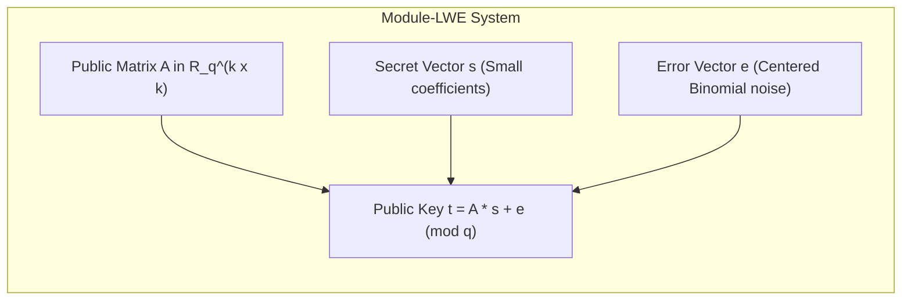
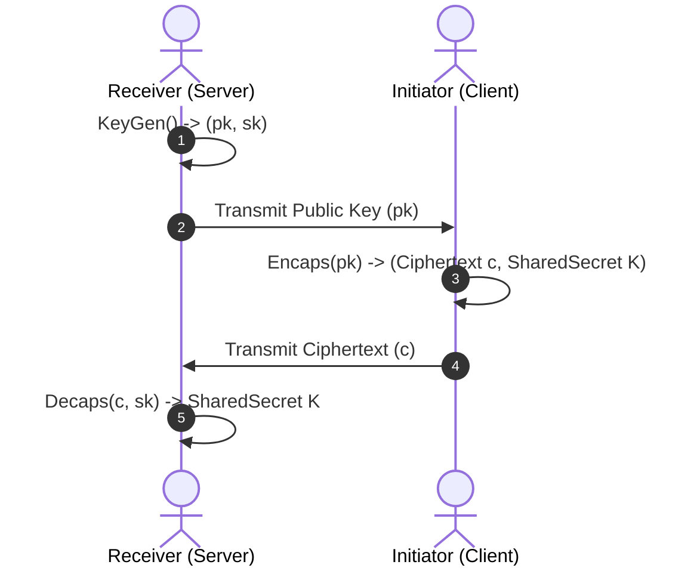

import { TabbedCodeBlock } from '../../components/ui/TabbedCodeBlock';
import { Callout } from '../../components/ui/Callout';

export const pqcSnippets = {
  c: {
    label: 'C99 (Number Theoretic Transform - NTT)',
    ext: 'c',
    lang: 'c',
    filename: 'kyber_ntt.c',
    code: `#include <stdint.h>

#define KYBER_N 256
#define KYBER_Q 3329
#define MONTGOMERY_FACTOR 2285 // 2^16 % 3329

int16_t montgomery_reduce(int32_t a) {
    int16_t t;
    t = (int16_t)a * 62209; // Q^{-1} mod 2^16
    t = (a - (int32_t)t * KYBER_Q) >> 16;
    return t;
}

// Forward NTT over R_q = Z_q[X]/(X^256 + 1)
void ntt(int16_t poly[KYBER_N], const int16_t zetas[128]) {
    unsigned int len, start, j, k = 1;
    int16_t zeta, t;

    for (len = 128; len >= 2; len >>= 1) {
        for (start = 0; start < KYBER_N; start += 2 * len) {
            zeta = zetas[k++];
            for (j = start; j < start + len; j++) {
                t = montgomery_reduce((int32_t)zeta * poly[j + len]);
                poly[j + len] = poly[j] - t;
                poly[j] = poly[j] + t;
            }
        }
    }
}`
  },
  go: {
    label: 'Go (Hybrid X25519 + ML-KEM Key Exchange)',
    ext: 'go',
    lang: 'go',
    filename: 'hybrid_kem.go',
    code: `package main

import (
	"crypto/ecdh"
	"crypto/rand"
	"crypto/sha256"
	"fmt"
	"io"
)

type HybridSharedSecret struct {
	ECDHSecret  []byte
	MLKEMSecret []byte
}

func (h *HybridSharedSecret) DeriveCombinedKey() []byte {
	hasher := sha256.New()
	hasher.Write(h.ECDHSecret)
	hasher.Write(h.MLKEMSecret)
	return hasher.Sum(nil)
}

func main() {
	curve := ecdh.X25519()
	clientPriv, _ := curve.GenerateKey(rand.Reader)
	clientPub := clientPriv.PublicKey()

	serverPriv, _ := curve.GenerateKey(rand.Reader)
	serverPub := serverPriv.PublicKey()

	ecdhSecret, _ := clientPriv.ECDH(serverPub)
	mockMLKEMSecret := make([]byte, 32)
	_, _ = io.ReadFull(rand.Reader, mockMLKEMSecret)

	hybrid := &HybridSharedSecret{
		ECDHSecret:  ecdhSecret,
		MLKEMSecret: mockMLKEMSecret,
	}

	finalKey := hybrid.DeriveCombinedKey()
	fmt.Printf("Derived Post-Quantum Hybrid Secret: %x\\n", finalKey)
}`
  }
};

Modern secure internet communications rely on three public-key cryptographic primitives: RSA, Diffie-Hellman (DH), and Elliptic Curve Cryptography (ECDH / ECDSA).

These algorithms derive their security from two mathematical problems:
1. **Integer Factorization**: Factoring the product of two large prime numbers ($N = p \times q$).
2. **The Discrete Logarithm Problem**: Finding $k$ given $g$ and $g^k \pmod p$, or finding scalar $k$ on elliptic curve point $P = k \cdot G$.

In 1994, mathematician Peter Shor published **Shor's Algorithm**. When executed on a sufficiently large, fault-tolerant quantum computer (a Cryptographically Relevant Quantum Computer, or CRQC), Shor's algorithm solves discrete logarithms and integer factorization in $O((\log N)^3)$ polynomial time.

This represents a complete break of RSA, ECDH, and Ed25519 signatures.

Even before large quantum computers are built, security architects face the **"Harvest Now, Decrypt Later"** threat: adversaries intercept and store encrypted internet traffic today, preparing to decrypt it retroactively once quantum hardware matures.

---

## 1. Summary & NIST Standardized PQC Algorithms

In August 2024, the National Institute of Standards and Technology (NIST) published its final post-quantum standards:

| NIST Standard | Algorithm Name | Former Name | Category | Primary Use Case |
| :--- | :--- | :--- | :--- | :--- |
| **FIPS 203** | **ML-KEM** | CRYSTALS-Kyber | Module Lattice Key Encapsulation | TLS 1.3 Key Exchange, VPN handshakes |
| **FIPS 204** | **ML-DSA** | CRYSTALS-Dilithium | Module Lattice Digital Signatures | Digital certificates, code signing, PKI |
| **FIPS 205** | **SLH-DSA** | SPHINCS+ | Stateless Hash-Based Signatures | Fallback signature scheme (Zero lattice math) |

---

## 2. Mathematical Foundation: Module Learning With Errors (M-LWE)

ML-KEM (Kyber) bases its hardness on the **Module Learning With Errors (M-LWE)** problem over polynomial rings.

Let the ring be:

$$R_q = \mathbb{Z}_q[X] / (X^{256} + 1)$$

where $q = 3329$. Elements in $R_q$ are polynomials of degree less than 256 with integer coefficients modulo 3329.

The fundamental hardness property:
- **Forward Computation**: Given matrix $\mathbf{A}$, secret vector $\mathbf{s}$, and error $\mathbf{e}$, calculating $\mathbf{t} = \mathbf{A} \mathbf{s} + \mathbf{e} \pmod q$ is fast via the **Number Theoretic Transform (NTT)** ($O(N \log N)$ complexity).
- **Adversarial Inversion**: Given $\mathbf{A}$ and $\mathbf{t}$, finding $\mathbf{s}$ or $\mathbf{e}$ requires finding shortest vectors in high-dimensional Euclidean lattices, a problem where no polynomial-time quantum algorithm exists.

---

## 3. Key Encapsulation Mechanism (KEM) Protocol Flow

Unlike Diffie-Hellman where both parties compute key halves symmetrically, a KEM operates in three explicit phases:

1. **`KeyGen()`**: Alice generates public key $pk = (\mathbf{t}, \rho)$ and private key $sk = \mathbf{s}$.
2. **`Encaps(pk)`**: Bob generates a random 32-byte secret $m$, encrypts it under Alice's public key to create ciphertext $c$, and hashes $m$ to derive symmetric key $K$.
3. **`Decaps(c, sk)`**: Alice uses her secret key $\mathbf{s}$ to decrypt ciphertext $c$, recovering secret $m$ and deriving the identical symmetric key $K$.

---

## 4. Hybrid Key Exchange in TLS 1.3 (X25519Kyber768)

To guarantee that modern connections remain secure even if an unforeseen cryptanalytic breakthrough weakens lattices, the IETF and major browsers (Chrome, Firefox, Cloudflare) mandate **Hybrid Key Exchange**.

Clients negotiate both classical **X25519** and post-quantum **ML-KEM-768** in parallel:

$$K_{\text{session}} = \text{HKDF-Extract}(\text{ECDH\_Secret} \mathbin{\Vert} \text{MLKEM\_Secret})$$

An attacker must break **both** the Elliptic Curve Discrete Logarithm problem and the Module Lattice Shortest Vector problem to decipher the session.

<Callout type="tip" title="Performance Overhead">
Kyber-768 public keys are 1,184 bytes and ciphertexts are 1,088 bytes (compared to 32 bytes for X25519). However, polynomial arithmetic via NTT executes in less than 50 microseconds on modern CPUs, negligible compared to network round-trip times.
</Callout>

---

## 5. Dual-Language Implementation

<TabbedCodeBlock client:load title="NTT Polynomial Transform & Hybrid KEM" snippets={pqcSnippets} defaultFilenamePrefix="pqc_mlkem" />

---

## 6. Architectural Guidance

- Enable **X25519MLKEM768** hybrid key exchange on TLS termination proxies (Envoy, Nginx, Cloudflare) immediately to mitigate "Harvest Now, Decrypt Later" exposure on sensitive data with long confidentiality horizons (financial, healthcare, defense).
- Plan for MTU fragmentation: larger public keys (~1.2KB) may push TLS ClientHello packets across TCP packet boundaries, requiring validation of middlebox and firewall handling of multi-packet handshakes.
