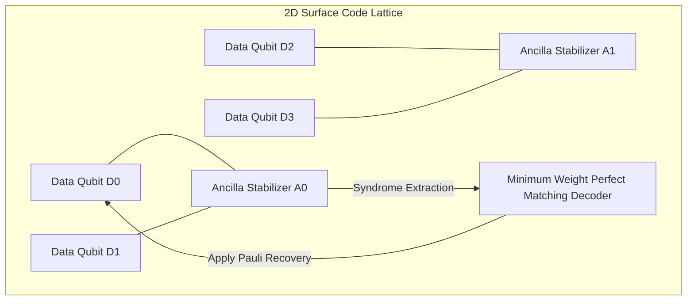

import { QuantumErrorCorrectionVisualizer } from '../../components/visualizers/QuantumErrorCorrectionVisualizer';
import { Callout } from '../../components/ui/Callout';

To transition quantum computing from the **Noisy Intermediate-Scale Quantum (NISQ)** era to fault-tolerant quantum computation, systems must protect quantum information against environmental decoherence and gate noise.

Because the **No-Cloning Theorem** prevents copying unknown quantum states, and measurement collapses superpositions, traditional error correction cannot be used. Modern fault-tolerant architectures rely on **Quantum Error Correction (QEC)** and **2D Surface Codes**.

---

## 1. Summary & Key Takeaways

- **Physical vs Logical Qubits**: A single fault-tolerant **Logical Qubit** is encoded across an array of hundreds or thousands of noisy **Physical Data Qubits**.
- **Pauli Noise Operators**: Quantum errors decompose into Pauli Bit-Flips ($X$), Phase-Flips ($Z$), or combined Bit-and-Phase-Flips ($Y = iXZ$).
- **Ancilla Stabilizer Measurements**: Entangled **Ancilla Qubits** interleave physical data qubits to measure $XXXX$ and $ZZZZ$ stabilizer operators, extracting error **syndromes** without measuring or destroying the underlying quantum superposition.
- **Minimum Weight Perfect Matching (MWPM) Decoder**: Classical graph-matching algorithms compute the shortest path between defect syndromes to apply recovery Pauli operators.

---

## 2. Interactive 2D Surface Code Lattice Simulator

Inject simulated **Pauli Bit-Flip ($X$)** or **Phase-Flip ($Z$)** noise into the 2D Surface Code Lattice below, observe the ancilla stabilizer syndrome triggers, and run the **MWPM Decoder** to correct errors!

<Callout type="tip" title="Quantum Noise & Error Correction Experiment">
Inject Pauli X or Z noise to trigger Ancilla Stabilizers, then run the **MWPM Decoder** to observe syndrome graph matching and quantum state recovery!
</Callout>

<QuantumErrorCorrectionVisualizer client:visible />

---

## 3. Surface Code Lattice Architecture

---

## 4. Quantum Error Correction Matrix

| Concept | Classical Error Correction | Quantum Error Correction (QEC) |
| :--- | :--- | :--- |
| **State Duplication** | Allowed (Repetition Code: $0 \rightarrow 000$) | **Forbidden** (No-Cloning Theorem) |
| **Error Type** | Bit Flip ($0 \leftrightarrow 1$) | Continuous ($X$ Bit-Flip, $Z$ Phase-Flip, $Y$ Both) |
| **Measurement** | Direct Bit Inspection | **Indirect** (Ancilla Stabilizer Syndrome Measurement) |
| **Decoding Algorithm** | Majority Voting | **MWPM** (Graph Matching Shortest Paths) |
