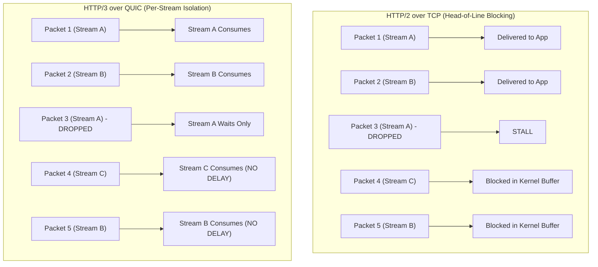

import { TabbedCodeBlock } from '../../components/ui/TabbedCodeBlock';
import { Callout } from '../../components/ui/Callout';

export const quicSnippets = {
  go: {
    label: 'Go (quic-go Multiplexed Server)',
    ext: 'go',
    lang: 'go',
    filename: 'quic_server.go',
    code: `package main

import (
	"context"
	"crypto/tls"
	"fmt"
	"io"
	"log"

	"github.com/quic-go/quic-go"
)

func handleSession(conn quic.Connection) {
	for {
		stream, err := conn.AcceptStream(context.Background())
		if err != nil {
			return
		}

		go func(s quic.Stream) {
			defer s.Close()
			buf := make([]byte, 1024)
			n, _ := s.Read(buf)
			response := fmt.Sprintf("Echo stream %d: %s", s.StreamID(), string(buf[:n]))
			_, _ = s.Write([]byte(response))
		}(stream)
	}
}

func main() {
	tlsConf := &tls.Config{NextProtos: []string{"h3", "quic-demo"}}
	listener, err := quic.ListenAddr("0.0.0.0:4242", tlsConf, nil)
	if err != nil {
		log.Fatal(err)
	}
	defer listener.Close()

	for {
		conn, err := listener.Accept(context.Background())
		if err == nil {
			go handleSession(conn)
		}
	}
}`
  },
  rust: {
    label: 'Rust (Quinn Transport Client)',
    ext: 'rs',
    lang: 'rust',
    filename: 'quinn_client.rs',
    code: `use quinn::{Endpoint, Connection};
use std::net::SocketAddr;

pub async fn fetch_stream(connection: &Connection, payload: &[u8]) -> Result<Vec<u8>, Box<dyn std::error::Error>> {
    // Open bidirectional stream independently isolated from concurrent streams
    let (mut send, mut recv) = connection.open_bi().await?;
    send.write_all(payload).await?;
    send.finish()?;

    let response = recv.read_to_end(1024 * 64).await?;
    Ok(response)
}`
  }
};

The evolution of web transport protocols has continually chased concurrency:
- **HTTP/1.1**: Addressed concurrency by opening 6 to 8 parallel TCP connections per host. Each connection suffered separate TCP slow-start and TLS handshakes, consuming significant memory and server resources.
- **HTTP/2**: Solved connection bloat by multiplexing hundreds of streams over a **single TCP connection**, reducing connection overhead and enabling header compression (HPACK).

However, HTTP/2 introduced a critical vulnerability rooted in the operating system kernel: **TCP Head-of-Line (HoL) Blocking**.

Under adverse network conditions (mobile cellular handoffs, Wi-Fi jitter, congested switches), a single dropped IP packet on an HTTP/2 connection freezes all concurrent streams simultaneously.

**QUIC (RFC 9000)** and **HTTP/3** redesign web transport from the ground up by leaving TCP behind and building an encrypted, multiplexed transport protocol on top of **UDP**.

---

## 1. Summary & Protocol Comparison

| Architectural Property | HTTP/1.1 over TCP | HTTP/2 over TCP | HTTP/3 over QUIC / UDP |
| :--- | :--- | :--- | :--- |
| **Transport Layer** | TCP (Kernel space) | TCP (Kernel space) | UDP (Userspace QUIC engine) |
| **Multiplexing** | No (parallel TCP sockets) | Yes (logical frames in single stream) | Yes (independent physical streams) |
| **Head-of-Line Blocking** | At application layer | At transport layer (TCP packet loss stalls all) | Eliminated (packet loss isolated per stream) |
| **Handshake Latency** | 2-3 RTTs (TCP + TLS) | 2-3 RTTs (TCP + TLS) | 1 RTT initial, 0-RTT resumption |
| **Connection Migration** | Breaks on IP change | Breaks on IP change | Resilient via Connection ID (CID) |
| **Encryption Scope** | Payload only (TLS) | Payload only (TLS) | Transport headers + payload (TLS 1.3 baked-in) |

---

## 2. The TCP Head-of-Line Blocking Problem

TCP is a byte-stream protocol that guarantees strictly ordered in-sequence delivery. The kernel has no understanding of HTTP/2 streams; it sees only a sequence of numbered TCP segments.

If segment #3 containing data for **Stream A** is dropped:
1. The kernel TCP receiver receives segments #4 and #5 containing data for **Streams B and C**.
2. Because segment #3 is missing, the kernel **refuses** to deliver segments #4 and #5 to the user application buffer.
3. Streams B and C stall completely until a TCP retransmission repairs segment #3.

In QUIC, each stream maintains its own independent offset and flow control window. If packet 3 drops, only Stream A pauses; Streams B and C continue processing without interruption.

---

## 3. Connection Migration via Connection IDs (CID)

Traditional TCP sockets are bound to a 4-tuple:

$$\text{Socket} = (\text{Source IP}, \text{Source Port}, \text{Dest IP}, \text{Dest Port})$$

When a mobile device leaves a home Wi-Fi network and switches to 5G cellular, the device's source IP changes immediately. In TCP, this instantly breaks every active connection, triggering time-outs, re-handshakes, and failed downloads.

QUIC replaces IP-tuple identification with a cryptographic **Connection ID (CID)**:
- The 64-bit or 128-bit CID is carried in the QUIC packet header.
- When an IP address changes, the client transmits an authenticated packet from its new IP carrying the existing CID.
- The server validates the packet authentication tag and seamlessly migrates state to the new client IP without dropping the session.

<Callout type="tip" title="Zero-RTT Resumption">
Because TLS 1.3 is integrated directly into QUIC's transport framing, returning clients can send HTTP request data inside the very first UDP datagram (0-RTT), eliminating the round-trip latency required by traditional TCP + TLS handshakes.
</Callout>

---

## 4. Dual-Language Implementation

<TabbedCodeBlock client:load title="QUIC Multiplexed Server & Client" snippets={quicSnippets} defaultFilenamePrefix="quic_transport" />

---

## 5. Architectural Guidance

- Adopt **HTTP/3 and QUIC** for edge-facing services, mobile client APIs, and CDN delivery where users experience variable network latency and packet loss.
- For internal service-to-service communication inside low-latency datacenter fabrics (AWS VPC, GCP VPC), standard HTTP/2 over TCP or gRPC remains highly performant and places lower demands on kernel UDP receive buffer tuning.
