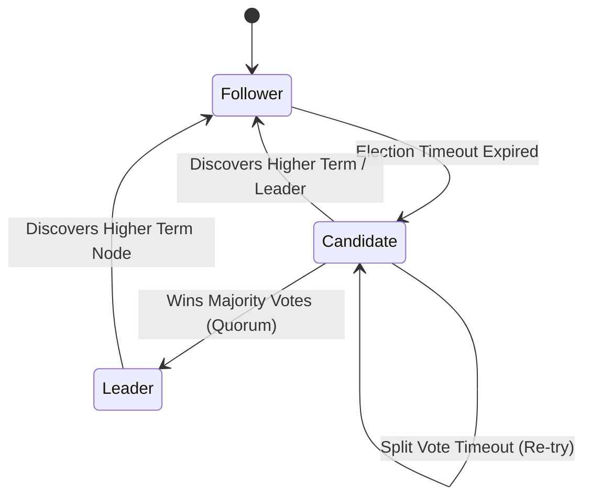

import { RaftConsensusVisualizer } from '../../components/visualizers/RaftConsensusVisualizer';
import { TabbedCodeBlock } from '../../components/ui/TabbedCodeBlock';
import { Callout } from '../../components/ui/Callout';

export const raftSnippets = {
  go: {
    label: 'Go (etcd / Raft RPC)',
    ext: 'go',
    lang: 'go',
    filename: 'raft_node.go',
    code: `package main

import "sync"

type Role int
const (
	Follower Role = iota
	Candidate
	Leader
)

type AppendEntriesArgs struct {
	Term         int        // Leader's current term
	LeaderId     int        // Leader ID
	PrevLogIndex int        // Index of preceding log entry
	PrevLogTerm  int        // Term of preceding log entry
	Entries      []LogEntry // Log entries to store
	LeaderCommit int        // Leader commitIndex
}

type AppendEntriesReply struct {
	Term    int  // CurrentTerm
	Success bool // true if follower matching PrevLogIndex & PrevLogTerm
}

type RaftNode struct {
	mu          sync.Mutex
	id          int
	currentTerm int
	votedFor    int
	role        Role
	log         []LogEntry
	commitIndex int
}

func (rf *RaftNode) AppendEntries(args *AppendEntriesArgs, reply *AppendEntriesReply) {
	rf.mu.Lock()
	defer rf.mu.Unlock()

	if args.Term < rf.currentTerm {
		reply.Term = rf.currentTerm
		reply.Success = false
		return
	}

	if args.Term > rf.currentTerm {
		rf.currentTerm = args.Term
		rf.role = Follower
		rf.votedFor = -1
	}

	reply.Term = rf.currentTerm
	reply.Success = true
}`
  },
  rust: {
    label: 'Rust (tokio-raft)',
    ext: 'rs',
    lang: 'rust',
    filename: 'raft_node.rs',
    code: `#[derive(Clone, Debug, PartialEq)]
pub enum NodeRole {
    Follower,
    Candidate,
    Leader,
    Offline,
}

pub struct RaftState {
    pub current_term: u64,
    pub voted_for: Option<u64>,
    pub commit_index: usize,
    pub role: NodeRole,
}

impl RaftState {
    pub fn handle_vote_request(&mut self, candidate_id: u64, term: u64) -> bool {
        if term > self.current_term {
            self.current_term = term;
            self.role = NodeRole::Follower;
            self.voted_for = Some(candidate_id);
            return true;
        }
        false
    }
}`
  }
};

In fault-tolerant distributed systems, a cluster of $N$ physical servers must agree on a single sequence of state machine operations, even in the presence of unreliable networks, message drops, and server crashes.

While Paxos was historically the dominant consensus protocol, its complex formulation made it notoriously difficult to implement correctly in production. The **Raft Consensus Algorithm** (*Ongaro & Ousterhout, Stanford 2014*) was designed specifically for **understandability** and operational correctness by decomposing consensus into three independent sub-problems: Leader Election, Log Replication, and Safety Rules.

---

## 1. Summary & Key Takeaways

- **Three Node Roles**: Leader, Follower, and Candidate.
- **Quorum Rule**: Requires a majority vote of $\lfloor N/2 \rfloor + 1$ nodes to elect leaders and commit log entries.
- **Logical Term Epochs**: Integer terms ($1, 2, 3, \dots$) act as logical clocks to detect stale leaders.

---

## 2. Interactive 5-Node Raft Cluster Simulator

Test leader failure, candidate election timeouts, and log entry replication across a 5-node cluster below:

<RaftConsensusVisualizer client:load />

---

## 3. Raft State Transition Diagram

---

## 4. Multi-Language Consensus Code Implementation

<TabbedCodeBlock client:load title="Raft RPC State Machine Implementation" snippets={raftSnippets} defaultFilenamePrefix="raft_consensus" />

---

## 5. Architectural Guidance

1. **Strict Leader Invariant**: Only nodes holding all committed log entries from previous terms can be elected Leader.
2. **Production Usage**: etcd (Kubernetes state store), HashiCorp Consul, CockroachDB, and Apache Kafka (KRaft mode) all use Raft for reliable metadata consensus.
