import { RayTracingVisualizer } from '../../components/visualizers/RayTracingVisualizer';
import { TabbedCodeBlock } from '../../components/ui/TabbedCodeBlock';
import { Callout } from '../../components/ui/Callout';

export const renderSnippets = {
  cpp: {
    label: 'C++20 (Ray-Sphere Intersect)',
    ext: 'cpp',
    lang: 'cpp',
    filename: 'raytracer.cpp',
    code: `#include <cmath>

struct Vec3 {
    float x, y, z;
    float dot(const Vec3& v) const { return x * v.x + y * v.y + z * v.z; }
    Vec3 operator-(const Vec3& v) const { return {x - v.x, y - v.y, z - v.z}; }
};

struct Ray {
    Vec3 origin;
    Vec3 direction;
};

struct Sphere {
    Vec3 center;
    float radius;
    
    bool intersect(const Ray& ray, float& t_hit) const {
        Vec3 oc = ray.origin - center;
        float a = ray.direction.dot(ray.direction);
        float b = 2.0f * oc.dot(ray.direction);
        float c = oc.dot(oc) - radius * radius;
        float discriminant = b * b - 4 * a * c;
        
        if (discriminant < 0) return false;
        t_hit = (-b - std::sqrt(discriminant)) / (2.0f * a);
        return t_hit > 0.001f;
    }
};`
  },
  rust: {
    label: 'Rust (Ray Tracing in a Weekend)',
    ext: 'rs',
    lang: 'rust',
    filename: 'raytracer.rs',
    code: `pub struct Ray {
    pub origin: [f32; 3],
    pub dir: [f32; 3],
}

pub struct Sphere {
    pub center: [f32; 3],
    pub radius: f32,
}

impl Sphere {
    pub fn hit(&self, ray: &Ray) -> Option<f32> {
        let oc = [
            ray.origin[0] - self.center[0],
            ray.origin[1] - self.center[1],
            ray.origin[2] - self.center[2],
        ];
        let a = ray.dir[0]*ray.dir[0] + ray.dir[1]*ray.dir[1] + ray.dir[2]*ray.dir[2];
        let half_b = oc[0]*ray.dir[0] + oc[1]*ray.dir[1] + oc[2]*ray.dir[2];
        let c = oc[0]*oc[0] + oc[1]*oc[1] + oc[2]*oc[2] - self.radius * self.radius;
        let discriminant = half_b * half_b - a * c;

        if discriminant < 0.0 {
            None
        } else {
            Some((-half_b - discriminant.sqrt()) / a)
        }
    }
}`
  }
};

Rendering realistic 3D scenes requires resolving a core question in computer graphics: **how does light interact with geometric surfaces before entering the camera viewport?**

For decades, real-time graphics engines (DirectX, Vulkan, OpenGL) relied almost exclusively on **Rasterization**. However, the advent of hardware-accelerated RT cores (NVIDIA RTX, Vulkan RT) enabled real-time **Path Tracing**.

---

## 1. Summary & Key Architectural Tradeoffs

| Rendering Paradigm | GPU Rasterization | Path Ray Tracing |
| :--- | :--- | :--- |
| **Complexity** | $O(\text{Triangles} + \text{Pixels})$ | $O(\text{Rays} \times \log_2(\text{BVH Triangles}))$ |
| **Reflections** | Screen-space approximations (SSR) | Physically exact recursive reflection rays |
| **Global Illumination** | Static baked lightmaps | Real-time Monte Carlo bounce sampling |
| **Hardware Requirement** | Standard GPU Raster Pipeline | Dedicated Hardware Acceleration (RT Cores) |

---

## 2. Interactive Ray Tracing vs. Rasterization Simulation

Test light ray propagation, reflection bounces, and object occlusion in the interactive optical scene below:

<RayTracingVisualizer client:load />

---

## 3. GPU Graphics Pipelines

```mermaid
graph TD
    subgraph Raster["GPU Rasterization Pipeline"]
    V["3D Mesh Vertices"] --> VS["1. Vertex Shader"]
    VS --> RAST["2. Triangle Rasterizer (NDC)"]
    RAST --> FS["3. Fragment Shader & Z-Buffer"]
    FS --> FB["4. 2D Framebuffer"]
    end

    subgraph RayTrace["Path Ray Tracing Pipeline"]
    CAM["Camera Pixel Ray"] --> BVH["1. BVH Tree Traversal"]
    BVH --> HIT["2. Geometry Ray Intersect"]
    HIT --> REF["3. Spawn Reflection / Shadow Rays"]
    REF --> ACC["4. Accumulate Radiant Energy"]
    end
```

---

## 4. Multi-Language Renderer Code Implementation

<TabbedCodeBlock client:load title="Ray-Geometry Intersection Code" snippets={renderSnippets} defaultFilenamePrefix="raytracing_engine" />

---

## 5. Optics Math: Specular Reflection Equation

When a light ray $\mathbf{D}$ hits a surface with unit normal vector $\mathbf{N}$, the reflected ray direction $\mathbf{R}$ is:

$$\mathbf{R} = \mathbf{D} - 2(\mathbf{D} \cdot \mathbf{N})\mathbf{N}$$
