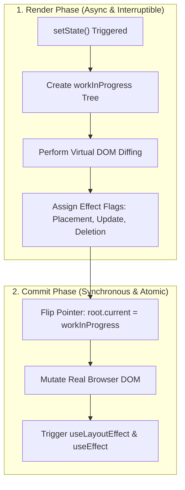

import { ReactFiberVisualizer } from '../../components/visualizers/ReactFiberVisualizer';
import { TabbedCodeBlock } from '../../components/ui/TabbedCodeBlock';
import { Callout } from '../../components/ui/Callout';

export const fiberSnippets = {
  typescript: {
    label: 'TypeScript (Fiber Node)',
    ext: 'ts',
    lang: 'typescript',
    filename: 'react_fiber_node.ts',
    code: `// React Fiber Node Type Definition
export type WorkTag = 0 | 3 | 5; // FunctionComponent, HostRoot, HostComponent

export interface Fiber {
  // Identity & Type
  tag: WorkTag;
  type: any;                 // 'div', 'button', or Component Function
  stateNode: any;            // Reference to actual DOM Node

  // Doubly Linked-List Tree Pointers
  child: Fiber | null;       // Points to FIRST child node
  sibling: Fiber | null;     // Points to NEXT sibling node
  return: Fiber | null;      // Points UP to parent node

  // Double Buffering & State
  alternate: Fiber | null;   // Mirror node in current <-> workInProgress tree
  memoizedState: any;        // Linked-list of hooks (useState, useEffect)
  flags: number;             // Mutation flags: Placement (2), Update (4), Deletion (8)
}`
  },
  javascript: {
    label: 'JavaScript (Work Loop)',
    ext: 'js',
    lang: 'javascript',
    filename: 'fiber_work_loop.js',
    code: `// Time-Slicing Cooperative Work Loop
let nextUnitOfWork = null;
let workInProgressRoot = null;

function workLoopConcurrent(deadline) {
  let shouldYield = false;
  
  while (nextUnitOfWork && !shouldYield) {
    nextUnitOfWork = performUnitOfWork(nextUnitOfWork);
    // Yield control if 5ms frame budget is exceeded
    shouldYield = deadline.timeRemaining() < 1;
  }

  if (!nextUnitOfWork && workInProgressRoot) {
    commitRoot(workInProgressRoot);
  }
}`
  }
};

Prior to React 16, React used a synchronous recursive tree traversal engine known as the **Stack Reconciler**.

When a high-level state change occurred in a complex app, the Stack Reconciler recursively walked the entire Virtual DOM tree in a single continuous synchronous execution block. If tree diffing took more than $16.6\text{ms}$ (the duration of a single 60Hz frame), the browser's main UI thread froze  -  causing dropped frames, sluggish text input, and un-responsive UI animations.

React 16 introduced the **Fiber Reconciler**, completely re-architecting React's internals around a custom cooperatively scheduled linked-list data structure.

---

## 1. Summary & Key Takeaways

- **Linked List Pointers**: `child`, `sibling`, and `return` replace the native call stack, allowing React to pause and resume work.
- **Double Buffering**: `current` vs `workInProgress` trees compute updates offscreen before flushing to the real DOM.
- **Two-Phase Commit**: Asynchronous, interruptible **Render Phase** followed by a synchronous, atomic **Commit Phase**.

---

## 2. Interactive Fiber Reconciler Simulator

Test how React builds `workInProgress` Fiber trees offscreen and applies atomic DOM updates:

<ReactFiberVisualizer client:load />

---

## 3. React Reconciliation Phase Pipeline

---

## 4. Multi-Language Fiber Internals Implementation

<TabbedCodeBlock client:load title="React Fiber Architecture Implementation" snippets={fiberSnippets} defaultFilenamePrefix="react_fiber_engine" />

---

## 5. Engineering Guidance

1. **Fiber Time-Slicing**: Breaks render work into 5ms micro-tasks so input typing stays responsive during heavy re-renders.
2. **Concurrent Features**: `useTransition` and `useDeferredValue` leverage Fiber interrupts to defer expensive offscreen UI trees.
