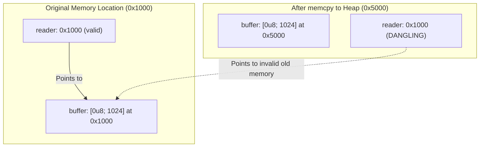

import { TabbedCodeBlock } from '../../components/ui/TabbedCodeBlock';
import { Callout } from '../../components/ui/Callout';

export const pinSnippets = {
  rust: {
    label: 'Rust (Self-Referential Future)',
    ext: 'rs',
    lang: 'rust',
    filename: 'self_referential.rs',
    code: `use std::marker::PhantomPinned;
use std::pin::Pin;
use std::ptr::NonNull;

pub struct SelfReferential {
    data: String,
    pointer: Option<NonNull<String>>,
    _marker: PhantomPinned,
}

impl SelfReferential {
    pub fn new(text: &str) -> Self {
        SelfReferential {
            data: text.to_string(),
            pointer: None,
            _marker: PhantomPinned,
        }
    }

    pub fn init(self: Pin<&mut Self>) {
        let this = unsafe { self.get_unchecked_mut() };
        this.pointer = Some(NonNull::from(&this.data));
    }

    pub fn read_pointer(self: Pin<&Self>) -> Option<&str> {
        self.pointer.map(|ptr| unsafe { ptr.as_ref().as_str() })
    }
}`
  },
  cpp: {
    label: 'C++20 (Coroutines Heap Frame)',
    ext: 'cpp',
    lang: 'cpp',
    filename: 'coroutine_frame.cpp',
    code: `#include <coroutine>
#include <iostream>
#include <string>

struct Task {
    struct promise_type {
        Task get_return_object() {
            return Task{std::coroutine_handle<promise_type>::from_promise(*this)};
        }
        std::suspend_never initial_suspend() noexcept { return {}; }
        std::suspend_always final_suspend() noexcept { return {}; }
        void return_void() noexcept {}
        void unhandled_exception() { std::terminate(); }
    };

    std::coroutine_handle<promise_type> handle;
    ~Task() { if (handle) handle.destroy(); }
};

Task async_computation() {
    std::string buffer = "intrusive state";
    std::string_view view(buffer);
    co_await std::suspend_always{};
    std::cout << view << std::endl;
}`
  }
};

In systems programming languages like C and C++, passing a struct by value or copying memory can break internal pointers if an object references its own fields. In C++, this issue is often sidestepped by allocating coroutine frames on the heap via compiler-generated `operator new`.

In Rust, every type is movable by default. When an object is passed by value, returned from a function, or assigned to a new variable, the compiler executes a bitwise copy (`memcpy`) of the data and invalidates the old memory location.

This fundamental guarantee broke down with the introduction of `async`/`await`. When the Rust compiler transforms an `async fn` into a cooperative state machine, variables kept alive across `.await` points often hold references to other local variables within that same stack frame, creating a **self-referential struct**.

If that state machine moves in memory, those internal pointers point to obsolete stack memory, leading to undefined behavior and memory corruption. **`std::pin::Pin`** is the compile-time mechanism that prevents this.

---

## 1. Summary & Safety Taxonomy

| Concept | Definition | Safety Role |
| :--- | :--- | :--- |
| **Move Semantics** | Bitwise `memcpy` of struct fields to new memory | Default Rust behavior for all unpinned types |
| **Self-Referential Struct** | A type whose fields store pointers to its own fields | Corrupted if moved after pointer initialization |
| **`std::pin::Pin<P>`** | Smart pointer wrapper around pointer type `P` | Guarantees the pointee will never move again before drop |
| **`Unpin` Auto Trait** | Trait automatically implemented for 99% of types | Tells the compiler: moving this type is completely safe |
| **`!Unpin` (`PhantomPinned`)** | Explicit opt-out of the `Unpin` trait | Enforces the pinning contract via the type system |

---

## 2. Why Async State Machines Require Pinning

Consider an asynchronous function that reads into a local buffer:

```rust
async fn process_socket() {
    let mut buffer = [0u8; 1024];
    let reader = &mut buffer;
    async_read(reader).await;
}
```

The compiler transforms this into an enum state machine similar to:

```rust
enum ProcessSocketFuture {
    State0,
    State1 {
        buffer: [0u8; 1024],
        reader: *mut [0u8; 1024],
    },
    Done,
}
```

If the caller executes `let mut fut = process_socket();` and later moves it to the heap or passes it across threads, the `reader` pointer would still target the original stack memory address where `buffer` initially resided.



---

## 3. The `Pin` Type Contract

`Pin<P>` wraps a pointer (such as `&mut T`, `Box<T>`, or `Rc<T>`).

The crucial invariant is: **if `T: !Unpin`, once a `Pin<&mut T>` is created, the underlying memory backing `T` must not be moved until `T` is dropped.**

```rust
impl<P: Deref<Target: Unpin>> DerefMut for Pin<P> {
    fn deref_mut(&mut self) -> &mut Self::Target { ... }
}
```

Notice the trait bound: `Pin` only implements `DerefMut` if the target implements `Unpin`. If `T` is `!Unpin`, you **cannot** obtain a bare `&mut T` via safe code, because having a bare mutable reference allows callers to call `std::mem::swap` or `std::mem::replace`, moving the value out of its pinned memory location.

<Callout type="caution" title="The Drop Invariant">
Pinning requires that <code>drop</code> must be called on the memory location before that memory can be reclaimed or overwritten. Writing a custom <code>Drop</code> implementation that moves fields out of a pinned struct violates the safety contract and results in undefined behavior.
</Callout>

---

## 4. Dual-Language Implementation

<TabbedCodeBlock client:load title="Self-Referential Memory Management" snippets={pinSnippets} defaultFilenamePrefix="pin_mechanics" />

---

## 5. Safe Structural Pin Projection

When writing custom data structures that contain pinned fields (such as combinator futures or actors), you need to project `Pin<&mut Parent>` into `Pin<&mut Child>`.

Doing this manually requires `unsafe` code. The de-facto standard solution in the Rust ecosystem is the **`pin-project`** procedural macro:

```rust
use pin_project::pin_project;

#[pin_project]
pub struct TimedTask<F> {
    #[pin]
    future: F,
    deadline: std::time::Instant,
}
```

The attribute macro automatically writes the correct `Unpin` bounds, generates safe `project()` methods, and guarantees that dropping the parent preserves the pinning invariant for all tagged child fields.
