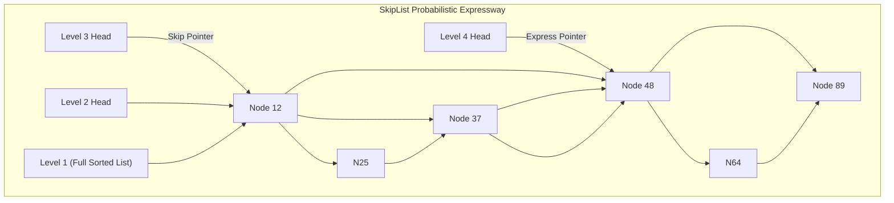

import { SkipListVisualizer } from '../../components/visualizers/SkipListVisualizer';
import { TabbedCodeBlock } from '../../components/ui/TabbedCodeBlock';
import { Callout } from '../../components/ui/Callout';

export const skiplistSnippets = {
  cpp: {
    label: 'C++20 (SkipList Node)',
    ext: 'cpp',
    lang: 'cpp',
    filename: 'skiplist.cpp',
    code: `#include <vector>
#include <random>
#include <atomic>

template <typename Key, typename Value>
struct SkipListNode {
    Key key;
    Value value;
    int height;
    std::vector<std::atomic<SkipListNode*>> forward;

    SkipListNode(Key k, Value v, int h)
        : key(k), value(v), height(h), forward(h) {
        for (int i = 0; i < h; ++i) forward[i].store(nullptr);
    }
};`
  },
  rust: {
    label: 'Rust (Crossbeam Lock-Free)',
    ext: 'rs',
    lang: 'rust',
    filename: 'skiplist.rs',
    code: `use std::sync::atomic::{AtomicPtr, Ordering};

pub struct SkipListNode<K, V> {
    pub key: K,
    pub value: V,
    pub tower: Vec<AtomicPtr<SkipListNode<K, V>>>,
}

impl<K: Ord, V> SkipListNode<K, V> {
    pub fn new(key: K, value: V, height: usize) -> Self {
        let mut tower = Vec::with_capacity(height);
        for _ in 0..height {
            tower.push(AtomicPtr::new(std::ptr::null_mut()));
        }
        Self { key, value, tower }
    }
}`
  }
};

In high-performance software systems, maintaining a sorted key-value mapping with fast $O(\log N)$ search, insertion, and range scanning is a critical requirement.

Historically, balanced binary search trees like **Red-Black Trees** were the standard choice (used in C++ `std::map`, Java `TreeMap`, and Linux kernel CFS scheduler). However, in concurrent multi-threaded environments, Red-Black Trees require expensive global mutex locks because tree rotations mutate multiple parent and child pointers simultaneously.

**SkipLists** (*William Pugh, 1990*) replace strict tree rotations with probabilistic multi-level linked towers, enabling high-concurrency lock-free atomic pointer swaps (`Compare-And-Swap`).

---

## 1. Summary & Architectural Tradeoffs

| Feature Metric | Red-Black Tree | SkipList |
| :--- | :--- | :--- |
| **Search Time** | Strict $O(\log N)$ worst-case guarantee | Probabilistic $O(\log N)$ average |
| **Rebalancing Overhead** | Expensive tree rotations & color flips | Zero rotations (probabilistic coin-flip promotion) |
| **Lock-Free Concurrency** | Highly complex / bottlenecked | Native lock-free CAS pointer updates |
| **Primary Production Uses** | C++ `std::map`, Java `TreeMap`, Linux CFS | Redis Sorted Sets (`zset`), RocksDB Memtable |

---

## 2. Interactive SkipList Multi-Level Tower Visualizer

Test how coin-flip tower promotions maintain fast $O(\log N)$ search expressways below:

<SkipListVisualizer client:load />

---

## 3. SkipList Dataflow Pipeline

---

## 4. Multi-Language SkipList Code Implementation

<TabbedCodeBlock client:load title="Lock-Free SkipList Node Implementation" snippets={skiplistSnippets} defaultFilenamePrefix="skiplist_engine" />

---

## 5. Engineering Takeaways

1. **Lock-Free Scaling**: SkipLists mutate pointer arrays without global tree locks, making them ideal for high-throughput RAM indexes like Redis `ZADD` and RocksDB `Memtable`.
2. **Simplified Implementation**: SkipList code is significantly simpler and safer to audit than Red-Black Tree rotation balancing logic.
