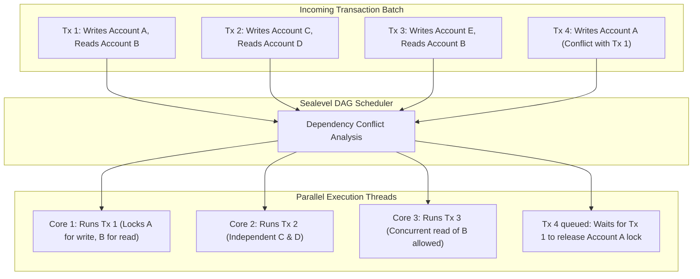

import { TabbedCodeBlock } from '../../components/ui/TabbedCodeBlock';
import { Callout } from '../../components/ui/Callout';

export const sealevelSnippets = {
  rust: {
    label: 'Rust (Solana Account Access Validation)',
    ext: 'rs',
    lang: 'rust',
    filename: 'sealevel_program.rs',
    code: `use solana_program::{
    account_info::{next_account_info, AccountInfo},
    entrypoint::ProgramResult,
    program_error::ProgramError,
    pubkey::Pubkey,
};

pub fn process_transfer(
    _program_id: &Pubkey,
    accounts: &[AccountInfo],
    amount: u64,
) -> ProgramResult {
    let account_info_iter = &mut accounts.iter();

    // Accounts explicitly declared in transaction header
    let source_account = next_account_info(account_info_iter)?;
    let dest_account = next_account_info(account_info_iter)?;

    // Enforce write permissions declared in transaction envelope
    if !source_account.is_writable || !dest_account.is_writable {
        return Err(ProgramError::InvalidAccountData);
    }

    // Enforce signer permission
    if !source_account.is_signer {
        return Err(ProgramError::MissingRequiredSignature);
    }

    **source_account.try_borrow_mut_lamports()? -= amount;
    **dest_account.try_borrow_mut_lamports()? += amount;

    Ok(())
}`
  },
  go: {
    label: 'Go (Parallel Account DAG Scheduler)',
    ext: 'go',
    lang: 'go',
    filename: 'scheduler.go',
    code: `package main

import (
	"sync"
)

type Transaction struct {
	ID        int
	ReadKeys  []string
	WriteKeys []string
}

type ParallelScheduler struct {
	locks sync.Map
}

func (s *ParallelScheduler) CanExecuteConcurrently(txA, txB Transaction) bool {
	// Check for Read-After-Write or Write-After-Write hazards
	writesA := make(map[string]bool)
	for _, k := range txA.WriteKeys {
		writesA[k] = true
	}

	for _, k := range txB.WriteKeys {
		if writesA[k] {
			return false // Write-After-Write conflict
		}
	}

	for _, k := range txB.ReadKeys {
		if writesA[k] {
			return false // Read-After-Write conflict
		}
	}

	return true
}`
  }
};

Traditional virtual machines (such as the Ethereum Virtual Machine) execute transactions in a strictly sequential, single-threaded loop.

The reason EVM nodes cannot parallelize execution across CPU cores is **implicit state access**: an EVM smart contract can dynamically read or write to any arbitrary address or storage slot during execution. Two transactions might touch the same ERC-20 balance or Uniswap pool without warning, making concurrent execution susceptible to race conditions and non-deterministic state splits.

**Solana's Sealevel** runtime solves this by requiring transactions to declare their complete state dependencies ahead of time. By analyzing these declarations before execution begins, Sealevel parallelizes thousands of non-overlapping transactions across all available CPU cores and GPU acceleration pipelines.

---

## 1. Summary & Execution Model Comparison

| Architectural Property | EVM Execution Model (Ethereum) | Sealevel Execution Model (Solana) |
| :--- | :--- | :--- |
| **Execution Concurrency** | Single-threaded sequential loop | Multi-threaded parallel pipeline |
| **State Access Declaration** | Dynamic & implicit during execution | Static & explicit in transaction envelope |
| **Account Locking** | Global stop-the-world state lock | Fine-grained read/write locking per account |
| **Virtual Machine** | Custom 256-bit stack interpreter | Extended BPF (eBPF / SBF) JIT compiled to x86_64 |
| **Throughput Scaling** | Bounded by single CPU core clock speed | Scales horizontally with physical CPU core count |

---

## 2. Explicit Account Dependency Declarations

Every Solana transaction envelope contains an **Account Keys Matrix** specifying:
1. The 32-byte public key of every account accessed.
2. An `is_signer` boolean flag verifying private key authorization.
3. An `is_writable` boolean flag specifying whether the account state can be mutated.

### Concurrency Rules
- **Multiple Readers**: Any number of transactions can concurrently read account $B$ in parallel across different CPU cores.
- **Single Writer**: A transaction requiring write access to account $A$ gains an exclusive lock on $A$. Other transactions modifying $A$ are queued until the write lock is released.
- **Independent Parallelism**: Transactions modifying distinct accounts (e.g. Tx 1 on $A$ vs Tx 2 on $C$) execute simultaneously with zero contention.

---

## 3. Solana Bytecode Format (SBF) & Just-In-Time Compilation

Rather than designing an esoteric, proprietary virtual machine, Solana adopts an optimized variant of the **Linux eBPF** instruction set: **Solana Bytecode Format (SBF)**.

Developers compile high-level Rust, C, or Zig code via LLVM directly into SBF bytecode.

When a program is deployed:
1. SBF bytecode is verified for safety, branch bounds, and instruction limits.
2. A validator's runtime Just-In-Time (JIT) compiler transforms the SBF bytecode into **native x86_64 or ARM64 machine instructions**.
3. Programs execute directly on the host CPU hardware without interpreter overhead, performing zero-cost memory copies and native register operations.

<Callout type="tip" title="Predictable State Locality">
Separating smart contract code (which is marked immutable and read-only) from state data accounts guarantees that program code pages can be shared across all executing threads without locks or cache invalidation stalls.
</Callout>

---

## 4. Dual-Language Implementation

<TabbedCodeBlock client:load title="Sealevel Program Validation & DAG Scheduler" snippets={sealevelSnippets} defaultFilenamePrefix="sealevel_engine" />

---

## 5. Architectural Guidance

- Structure state architectures around fine-grained, independent accounts rather than monolithic global registries to maximize Sealevel parallel scheduling throughput.
- Keep `is_writable` flags strictly limited to accounts that genuinely mutate state during the instruction; marking an account writable unnecessarily forces the scheduler to serialize transactions that could otherwise run in parallel.
- Leverage zero-copy deserialization (such as `bytemuck` or Anchor `zero_copy`) in Rust programs to avoid allocating heap memory during high-frequency transaction execution.
