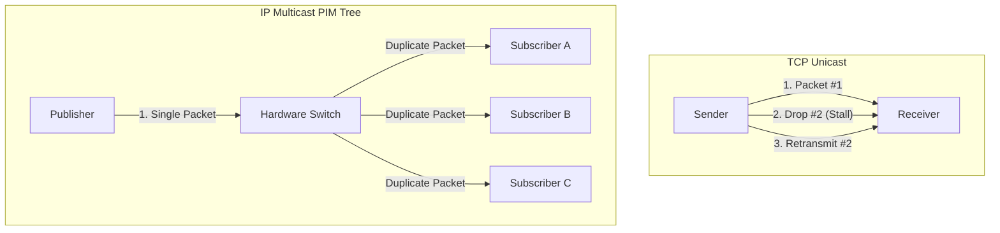

import { MulticastVisualizer } from '../../components/visualizers/MulticastVisualizer';
import { Callout } from '../../components/ui/Callout';

In financial exchanges, high-frequency trading (HFT) platforms, and real-time media streaming, network protocol choice directly governs latency, throughput, and system architecture.

While standard web applications rely almost exclusively on **TCP Unicast**, market data feeds and high-speed telemetry use **Raw UDP** and **IP Multicast (IGMP / PIM-SM)**.

---

## 1. Summary & Key Takeaways

- **Unicast TCP**: Provides reliable byte stream delivery and congestion control. However, packet drops trigger **Head-of-Line Blocking** and Retransmission Timeouts (RTO), stalling processing pipelines.
- **Raw UDP**: Connectionless, zero-handshake datagram protocol. Eliminates head-of-line blocking, but offers no native delivery or ordering guarantees.
- **IP Multicast (IGMP / PIM-SM)**: A single packet published by a sender is duplicated by network hardware switches directly to all subscribed hosts in an IGMP multicast group (e.g. `239.255.0.1`).
- **Multicast Quirks & Duplicates**: Dynamic Protocol Independent Multicast (PIM) tree re-convergence and IGMP snooping updates can cause temporary duplicate packets or out-of-order delivery that application layers must handle.

---

## 2. Interactive Protocol & Market Data Simulator

Use the interactive simulator below to test packet transmission under simulated network packet loss across **TCP Unicast**, **Raw UDP**, and **IP Multicast**!

<Callout type="tip" title="Network Loss Experiment">
Increase packet loss to 30% and switch between TCP (watch retransmissions & stalls), UDP (watch packet drops), and Multicast (observe hardware duplication & PIM tree routing).
</Callout>

<MulticastVisualizer client:visible />

---

## 3. Protocol Architecture Comparison

---

## 4. Networking Protocol Matrix

| Protocol | Transmission Model | Packet Loss Handling | Duplicates Allowed | Primary Use Case |
| :--- | :--- | :--- | :--- | :--- |
| **TCP** | Point-to-Point Unicast | Retransmit (Head-of-Line Stalls) | No | Web APIs, SSH, File Transfer |
| **UDP** | Point-to-Point Unicast | Dropped (Application handles) | No | Gaming, Voice/Video, DNS |
| **IP Multicast** | One-to-Many Group (`239.x.x.x`) | Dropped or NAK Recovery | Yes (PIM tree quirks) | Market Data Feeds, IPTV |
