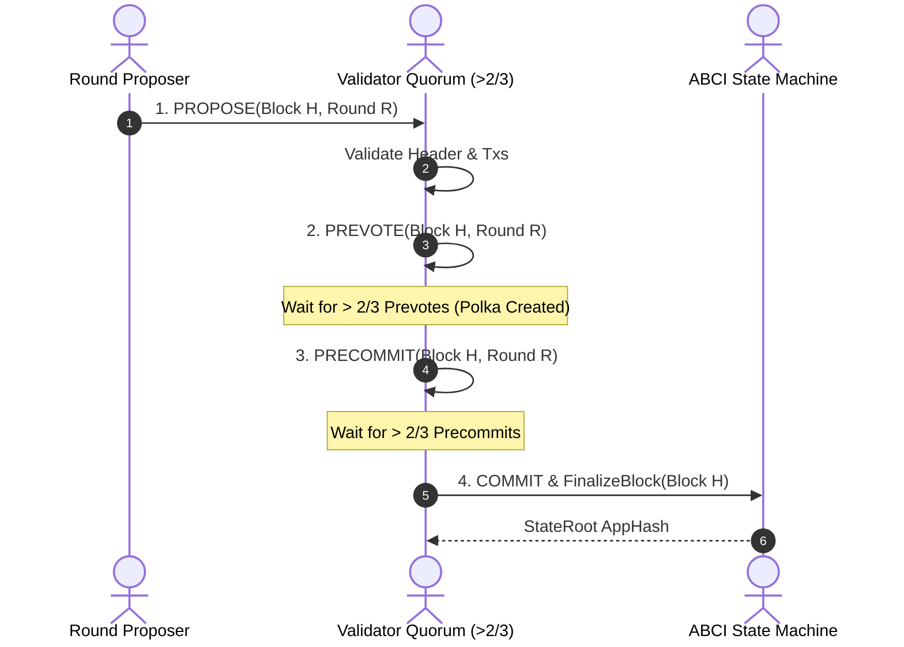

import { TabbedCodeBlock } from '../../components/ui/TabbedCodeBlock';
import { Callout } from '../../components/ui/Callout';

export const abciSnippets = {
  go: {
    label: 'Go (CometBFT ABCI 2.0 Application)',
    ext: 'go',
    lang: 'go',
    filename: 'abci_app.go',
    code: `package main

import (
	"context"

	abcitypes "github.com/cometbft/cometbft/abci/types"
)

type SovereignStateApp struct {
	abcitypes.BaseApplication
	stateRoot []byte
	kvStore   map[string]string
}

func NewSovereignStateApp() *SovereignStateApp {
	return &SovereignStateApp{
		kvStore: make(map[string]string),
	}
}

// CheckTx validates incoming transactions before gossip admission
func (app *SovereignStateApp) CheckTx(_ context.Context, req *abcitypes.CheckTxRequest) (*abcitypes.CheckTxResponse, error) {
	if len(req.Tx) == 0 || len(req.Tx) > 1024*1024 {
		return &abcitypes.CheckTxResponse{Code: 1, Log: "Invalid transaction size"}, nil
	}
	return &abcitypes.CheckTxResponse{Code: 0}, nil
}

// FinalizeBlock processes transactions deterministically at block finalization
func (app *SovereignStateApp) FinalizeBlock(_ context.Context, req *abcitypes.FinalizeBlockRequest) (*abcitypes.FinalizeBlockResponse, error) {
	txResults := make([]*abcitypes.ExecTxResult, len(req.Txs))
	for i, tx := range req.Txs {
		// Execute deterministic state transition
		key := string(tx[:16])
		val := string(tx[16:])
		app.kvStore[key] = val
		txResults[i] = &abcitypes.ExecTxResult{Code: 0}
	}

	return &abcitypes.FinalizeBlockResponse{
		TxResults: txResults,
		AppHash:   app.stateRoot,
	}, nil
}`
  },
  rust: {
    label: 'Rust (ABCI State Machine Transition)',
    ext: 'rs',
    lang: 'rust',
    filename: 'state_machine.rs',
    code: `use sha2::{Sha256, Digest};
use std::collections::BTreeMap;

pub struct StateMachine {
    storage: BTreeMap<Vec<u8>, Vec<u8>>,
    app_hash: [u8; 32],
}

impl StateMachine {
    pub fn new() -> Self {
        Self {
            storage: BTreeMap::new(),
            app_hash: [0u8; 32],
        }
    }

    pub fn apply_block(&mut self, txs: &[Vec<u8>]) -> [u8; 32] {
        let mut hasher = Sha256::new();
        hasher.update(&self.app_hash);

        for tx in txs {
            if tx.len() >= 32 {
                let key = tx[0..16].to_vec();
                let val = tx[16..].to_vec();
                self.storage.insert(key, val);
                hasher.update(tx);
            }
        }

        self.app_hash = hasher.finalize().into();
        self.app_hash
    }
}`
  }
};

In distributed consensus engineering, architectures split cleanly between two distinct paradigms:
1. **Probabilistic Finality (Nakamoto Consensus)**: Found in Bitcoin and Proof-of-Work systems. Transactions achieve deeper probabilistic finality as subsequent blocks are appended, but remain vulnerable to chain reorganizations (reorgs).
2. **Deterministic Instant Finality (Classical Byzantine Fault Tolerance)**: Descended from Castro & Liskov's PBFT and modernized by **Tendermint** and **CometBFT**. Once a block receives signed cryptographic commitments from a supermajority of validators, it is **immediately finalized**. Chain reorganizations are mathematically impossible without slashing malicious stake.

CometBFT powers over 100 independent sovereign blockchains across the Cosmos ecosystem (dYdX, Celestia, Osmosis) by decoupling consensus engine plumbing from application state machines via the **Application Blockchain Interface (ABCI)**.

---

## 1. Summary & Consensus Protocol Comparison

| Protocol Property | Nakamoto Consensus (Bitcoin / PoW) | CometBFT / Tendermint (PoS) |
| :--- | :--- | :--- |
| **Finality Type** | Probabilistic (6 confirmations ~ 60 mins) | Deterministic & Instant (1 block ~ 1-6 secs) |
| **Fault Tolerance Threshold** | Honest work majority ($> 50\%$ hashrate) | Byzantine Fault Tolerant ($3f + 1$, up to $33\%$ malicious stake) |
| **Chain Reorganizations** | Yes (longest chain rule allows reorgs) | None (reorgs impossible without duplicate signatures) |
| **Validator Set Size** | Uncapped (Permissionless PoW miners) | Scaled (typically 100 to 250 active bonded validators) |
| **Application Layer** | Hard-coded into miner node daemon | Decoupled via socket / gRPC (ABCI toolchain) |

---

## 2. Quorum Mathematics: $3f + 1$ Proof

In an asynchronous network where packets can be delayed, dropped, or manipulated by up to $f$ malicious Byzantine nodes, how many total nodes $N$ are required to reach safe, un-forkable agreement?

1. **Liveness Requirement**: If $f$ nodes are unresponsive (fail-stop), the remaining nodes must still have enough voting power to make progress. Therefore, any quorum $Q$ must satisfy:
   $$Q \le N - f$$
2. **Safety Requirement**: If two different quorums $Q_1$ and $Q_2$ are assembled, their intersection must contain at least one honest node to prevent dual block confirmations. Therefore:
   $$Q_1 + Q_2 - N \ge f + 1$$
   $$2(N - f) - N \ge f + 1 \implies N \ge 3f + 1$$

To tolerate $f$ Byzantine actors, the network requires a minimum of **$3f + 1$ voting power**. The threshold for quorum voting is strictly greater than two-thirds:

$$\text{Quorum Threshold} = \frac{2}{3} + 1 \text{ voting power}$$

---

## 3. The 3-Phase Consensus Loop

Every block round proceeds through three sequential phases: **Propose**, **Prevote**, and **Precommit**.

- **Polka State**: When a validator observes greater than $2/3$ valid prevotes for a proposed block, it enters the **Polka** state and locks its vote. It is strictly forbidden from prevoting for a different block in that round.
- **Instant Finality**: When greater than $2/3$ precommits are signed and broadcast, the block commits permanently. The consensus engine issues no forks.

---

## 4. ABCI 2.0: Decoupling Consensus from Application Code

The **Application Blockchain Interface (ABCI 2.0)** establishes a clean socket/IPC boundary separating CometBFT (networking, gossip, consensus) from the developer's state machine.

Developers can write blockchain state logic in Go, Rust, or C++ by implementing standard hooks:
- **`PrepareProposal`**: Allows the block proposer to modify, reorder, or inject synthetic transactions (e.g. oracle price feeds or MEV bundles) before broadcasting.
- **`ProcessProposal`**: Gives non-proposer validators immediate ability to reject invalid block structures before voting.
- **`CheckTx`**: Protects the mempool by filtering malformed or underfunded transactions before peer gossip.
- **`FinalizeBlock`**: Executes transactions sequentially, updates the state database, and returns the cryptographic `AppHash`.

<Callout type="tip" title="ABCI Modularity">
By standardizing on ABCI, a decentralized exchange or sovereign rollup can write its entire execution engine in high-performance Rust or Go without having to write or audit peer-to-peer networking, encryption, or consensus code.
</Callout>

---

## 5. Dual-Language Implementation

<TabbedCodeBlock client:load title="CometBFT ABCI 2.0 Application & State Machine" snippets={abciSnippets} defaultFilenamePrefix="abci_consensus" />

---

## 6. Architectural Guidance

- Choose **CometBFT / Tendermint** when building sovereign Layer 1 networks, decentralized oracle networks, or app-specific chains requiring sub-second finality and zero transaction rollbacks.
- Use **ABCI `PrepareProposal`** to perform in-protocol Maximal Extractable Value (MEV) auctions and transaction batch reordering directly within the consensus engine.
- Monitor validator set size: BFT message complexity scales quadratically ($O(N^2)$). For validator sets exceeding 300 nodes, utilize BLS signature aggregation or hierarchical subnet topology.
