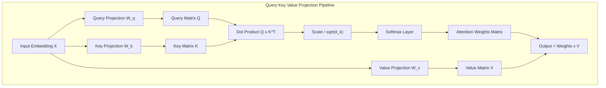

import { TransformerAttentionVisualizer } from '../../components/visualizers/TransformerAttentionVisualizer';
import { TabbedCodeBlock } from '../../components/ui/TabbedCodeBlock';
import { Callout } from '../../components/ui/Callout';

export const attentionSnippets = {
  python: {
    label: 'Python (PyTorch)',
    ext: 'py',
    lang: 'python',
    filename: 'self_attention.py',
    code: `import math
import torch
import torch.nn as nn
import torch.nn.functional as F

class ScaledDotProductAttention(nn.Module):
    def __init__(self, d_k: int):
        super().__init__()
        self.d_k = d_k

    def forward(self, Q: torch.Tensor, K: torch.Tensor, V: torch.Tensor, mask: torch.Tensor = None):
        # Q, K, V shape: [batch_size, num_heads, seq_len, d_k]
        
        # 1. Compute pairwise query-key alignment scores: Q x K^T
        scores = torch.matmul(Q, K.transpose(-2, -1)) / math.sqrt(self.d_k)
        
        # 2. Optional causal mask for autoregressive generation
        if mask is not None:
            scores = scores.masked_fill(mask == 0, -1e9)
            
        # 3. Softmax normalization across target tokens
        attn_weights = F.softmax(scores, dim=-1)
        
        # 4. Compute weighted sum of Value vectors
        output = torch.matmul(attn_weights, V)
        return output, attn_weights`
  },
  rust: {
    label: 'Rust (tch-rs)',
    ext: 'rs',
    lang: 'rust',
    filename: 'self_attention.rs',
    code: `use tch::{Tensor, Kind};

pub fn scaled_dot_product_attention(
    q: &Tensor, 
    k: &Tensor, 
    v: &Tensor, 
    d_k: f64
) -> (Tensor, Tensor) {
    // 1. Q x K^T / sqrt(d_k)
    let k_t = k.transpose(-2, -1);
    let scores = q.matmul(&k_t) / d_k.sqrt();
    
    // 2. Softmax along final dimension
    let attn_weights = scores.softmax(-1, Kind::Float);
    
    // 3. Attn x V
    let output = attn_weights.matmul(v);
    (output, attn_weights)
}`
  }
};

Prior to the introduction of the Transformer architecture (*Vaswani et al., 2017*), sequence processing relied heavily on Recurrent Neural Networks (RNNs) and LSTMs. Recurrent architectures processed tokens sequentially ($t_1 \rightarrow t_2 \rightarrow t_3$), creating severe memory bottlenecks over long context windows and preventing parallel GPU tensor execution.

The **Self-Attention Mechanism** eliminated recurrence entirely, allowing every token in a sequence to attend to every other token simultaneously in parallel GPU matrix multiplications.

---

## 1. Summary & Key Takeaways

- **Parallel GPU Execution**: Processes the entire $N$-token sequence concurrently in $O(1)$ sequential GPU operations.
- **Scaled Dot-Product Formula**:
  $$\text{Attention}(Q, K, V) = \text{Softmax}\left(\frac{Q K^T}{\sqrt{d_k}}\right) V$$
- **Coreference Resolution**: Allows tokens (e.g. `"it"`) to project high attention weights onto their referenced antecedents (e.g. `"animal"`).

---

## 2. Interactive Self-Attention Matrix Visualizer

Test how query tokens project attention weights across key tokens in the prompt below:

<TransformerAttentionVisualizer client:load />

---

## 3. QKV Matrix Dataflow Architecture

---

## 4. Multi-Language Implementation Code

<TabbedCodeBlock client:load title="Scaled Dot-Product Attention Implementation" snippets={attentionSnippets} defaultFilenamePrefix="attention_engine" />

---

## 5. Architectural Guidance

1. **Parallel Execution**: Self-attention eliminates $O(N)$ recurrence delays during training.
2. **Multi-Head Projections**: Splitting $d_{\text{model}}$ into multiple heads enables distinct heads to track syntactic, semantic, and positional relationships simultaneously.
