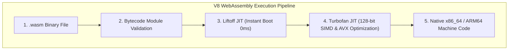

import { WasmSimdVisualizer } from '../../components/visualizers/WasmSimdVisualizer';
import { TabbedCodeBlock } from '../../components/ui/TabbedCodeBlock';
import { Callout } from '../../components/ui/Callout';

export const wasmSnippets = {
  wat: {
    label: 'WAT (Text Format SIMD)',
    ext: 'wat',
    lang: 'wasm',
    filename: 'simd_multiply.wat',
    code: `(module
  (memory (export "memory") 1)
  (func (export "vec_mul") (param $a v128) (param $b v128) (result v128)
    ;; Load 128-bit vector registers & execute parallel f32 multiply
    local.get $a
    local.get $b
    f32x4.mul
  )
)`
  },
  cpp: {
    label: 'C++ (Emscripten SIMD)',
    ext: 'cpp',
    lang: 'cpp',
    filename: 'simd_vector.cpp',
    code: `#include <wasm_simd128.h>

void multiply_arrays_simd(const float* a, const float* b, float* out, int size) {
    for (int i = 0; i < size; i += 4) {
        // Load 128-bit vector registers (4 floats)
        v128_t va = wasm_v128_load(&a[i]);
        v128_t vb = wasm_v128_load(&b[i]);
        // Single cycle 4-lane parallel multiplication
        v128_t vres = wasm_f32x4_mul(va, vb);
        wasm_v128_store(&out[i], vres);
    }
}`
  }
};

WebAssembly (Wasm) is a low-level binary instruction format designed as a portable compilation target for high-performance languages (C++, Rust, Go, Zig) in web browsers and edge runtimes (Wasmtime, Wasmer).

Unlike JavaScript JIT engines, which must dynamically infer variable types during runtime execution, Wasm modules are statically typed, pre-validated binary stack machines. Modern browser engines (V8, SpiderMonkey) compile Wasm bytecode into native x86_64/ARM64 machine code using tiered compilation pipelines (Liftoff baseline JIT $\rightarrow$ Turbofan optimizing JIT).

---

## 1. Summary & Key Takeaways

- **Linear Memory Model**: Wasm accesses memory via a sandboxed, contiguous ArrayBuffer (`WebAssembly.Memory`) with bounds checking.
- **128-bit SIMD (Single Instruction, Multiple Data)**: `v128` instructions process four 32-bit floats or sixteen 8-bit integers simultaneously in a single CPU instruction cycle.
- **Near-Native Speed**: Executes within 5-15% of native C++/Rust binary performance.

---

## 2. Interactive Wasm 128-bit SIMD Vector Simulator

Test parallel 4-lane float32 multiplications using 128-bit SIMD instructions below:

<WasmSimdVisualizer client:load />

---

## 3. V8 WebAssembly Compilation Pipeline

---

## 4. Multi-Language Wasm SIMD Code Implementation

<TabbedCodeBlock client:load title="WebAssembly 128-bit SIMD Code" snippets={wasmSnippets} defaultFilenamePrefix="wasm_simd" />

---

## 5. Architectural Guidance

1. **Use Cases**: Video decoding (FFmpeg Wasm), 3D game engines (Unreal/Unity Wasm), computer vision (OpenCV Wasm), and AI inference (ONNX Runtime Wasm).
2. **SIMD Advantage**: SIMD vectorization yields up to $4\times$ speedups for floating-point matrix operations and image processing.
