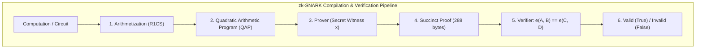

import { ZkProofVisualizer } from '../../components/visualizers/ZkProofVisualizer';
import { TabbedCodeBlock } from '../../components/ui/TabbedCodeBlock';
import { Callout } from '../../components/ui/Callout';

export const zkSnippets = {
  rust: {
    label: 'Rust (arkworks-rs zk-SNARK)',
    ext: 'rs',
    lang: 'rust',
    filename: 'zk_proof.rs',
    code: `use ark_bls12_381::{Bls12_381, Fr};
use ark_groth16::Groth16;
use ark_snark::SNARK;

pub fn generate_and_verify_zk_proof() {
    let mut rng = ark_std::test_rng();

    // 1. Setup Trusted Setup CRS Parameters
    let (pk, vk) = Groth16::<Bls12_381>::circuit_specific_setup(circuit, &mut rng).unwrap();

    // 2. Prover generates succinct proof without exposing secret 'x'
    let proof = Groth16::<Bls12_381>::prove(&pk, circuit, &mut rng).unwrap();

    // 3. Verifier checks proof in O(1) time using bilinear pairings
    let is_valid = Groth16::<Bls12_381>::verify(&vk, &public_inputs, &proof).unwrap();
    assert!(is_valid);
}`
  },
  circom: {
    label: 'Circom (zk Circuit)',
    ext: 'circom',
    lang: 'javascript',
    filename: 'multiplier.circom',
    code: `pragma circom 2.0.0;

template Multiplier2 () {
    // Private Inputs (Secret)
    signal input a;
    signal input b;
    // Public Output
    signal output c;

    // Constraint: a * b MUST equal c
    c <== a * b;
}

component main = Multiplier2();`
  }
};

In cryptography, a **Zero-Knowledge Proof (ZKP)** allows one party (the **Prover**) to mathematically convince another party (the **Verifier**) that a statement is true, without revealing any underlying private data beyond the validity of the statement itself.

A **zk-SNARK** stands for:
- **Zero-Knowledge**: No private information is leaked to the verifier.
- **Succinct**: Proof sizes are minuscule (e.g. 288 bytes) and verification takes $O(1)$ constant time ($\sim 1\text{ms}$).
- **Non-Interactive**: The prover generates a single proof payload sent to the verifier without back-and-forth roundtrips.
- **Argument of Knowledge**: The prover cannot forge a valid proof without actually possessing the private witness.

---

## 1. Summary & Key Takeaways

- **Bilinear Curve Pairings**: Verification evaluates $e(A, B) = e(C, D)$ over pairing-friendly elliptic curves (`BLS12-381` or `BN254`).
- **Arithmetization (R1CS)**: Programs are compiled into Rank-1 Constraint Systems ($A x \cdot B x = C x$).
- **Polynomial Commitments (KZG)**: Allows committing to a polynomial $P(X)$ in a single $32$-byte elliptic curve point.

---

## 2. Interactive zk-SNARK Prover-Verifier Simulator

Test polynomial root verification without exposing private secret $x$:

<ZkProofVisualizer client:load />

---

## 3. zk-SNARK Dataflow Architecture

---

## 4. Multi-Language zk Circuit Code Implementation

<TabbedCodeBlock client:load title="zk-SNARK Circuit & Verification Code" snippets={zkSnippets} defaultFilenamePrefix="zk_circuit" />

---

## 5. Engineering Guidance

1. **Use Cases**: Anonymous authentication, privacy-preserving identity (Semaphore/Worldcoin), layer-2 zk-Rollups (Starknet, zkSync, Polygon zkEVM).
2. **Performance**: Proving time is computationally heavy ($O(N \log N)$ FFT multiexponentiation), but verification is blazingly fast ($O(1)$ constant time).
