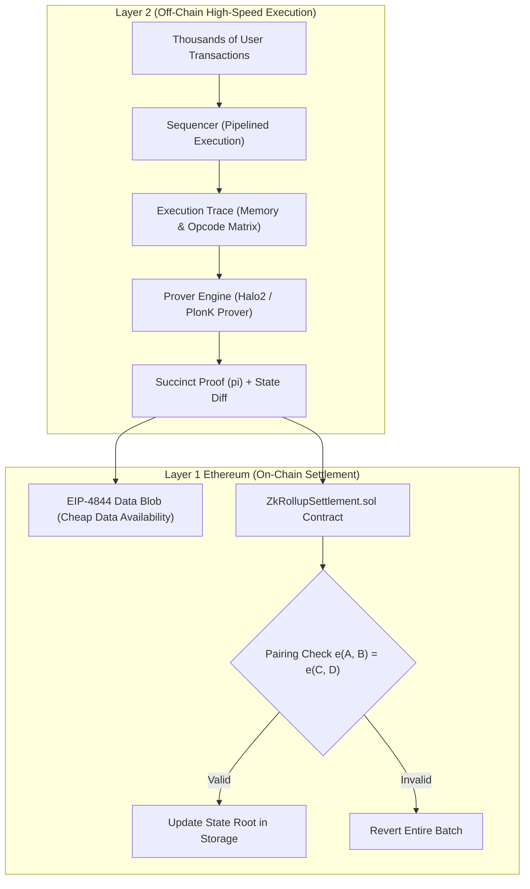

import { TabbedCodeBlock } from '../../components/ui/TabbedCodeBlock';
import { Callout } from '../../components/ui/Callout';

export const zkSnippets = {
  rust: {
    label: 'Rust (Halo2 PlonKish Custom Gate)',
    ext: 'rs',
    lang: 'rust',
    filename: 'zk_circuit.rs',
    code: `use halo2_proofs::{
    arithmetic::Field,
    circuit::{Chip, Layouter, SimpleFloorPlanner},
    plonk::{Advice, Column, ConstraintSystem, Error, Expression, Fixed, Selector},
    poly::Rotation,
};

#[derive(Clone, Debug)]
pub struct ArithmeticConfig {
    pub a: Column<Advice>,
    pub b: Column<Advice>,
    pub c: Column<Advice>,
    pub s_mul: Selector,
}

impl ArithmeticConfig {
    pub fn configure<F: Field>(meta: &mut ConstraintSystem<F>) -> Self {
        let a = meta.advice_column();
        let b = meta.advice_column();
        let c = meta.advice_column();
        let s_mul = meta.selector();

        meta.create_gate("multiplication_gate", |meta| {
            // Constraint: s_mul * (a * b - c) = 0
            let s = meta.query_selector(s_mul);
            let lhs = meta.query_advice(a, Rotation::cur());
            let rhs = meta.query_advice(b, Rotation::cur());
            let out = meta.query_advice(c, Rotation::cur());
            vec![s * (lhs * rhs - out)]
        });

        ArithmeticConfig { a, b, c, s_mul }
    }
}`
  },
  solidity: {
    label: 'Solidity (On-Chain KZG Pairing Verifier)',
    ext: 'sol',
    lang: 'solidity',
    filename: 'RollupVerifier.sol',
    code: `// SPDX-License-Identifier: MIT
pragma solidity ^0.8.24;

interface IZkVerifier {
    function verifyProof(
        bytes calldata proof,
        uint256[] calldata publicInputs
    ) external view returns (bool);
}

contract ZkRollupSettlement {
    bytes32 public stateRoot;
    IZkVerifier public immutable verifier;

    event BlockCommitted(bytes32 indexed oldRoot, bytes32 indexed newRoot, uint32 batchSize);

    constructor(address _verifier, bytes32 _initialRoot) {
        verifier = IZkVerifier(_verifier);
        stateRoot = _initialRoot;
    }

    function commitBatch(
        bytes32 newRoot,
        uint32 batchSize,
        bytes calldata proof,
        uint256[] calldata publicInputs
    ) external {
        // Verify public inputs match state transition
        require(publicInputs[0] == uint256(stateRoot), "Invalid old state root");
        require(publicInputs[1] == uint256(newRoot), "Invalid new state root");

        // Execute cryptographic pairing check (~200,000 gas flat)
        require(verifier.verifyProof(proof, publicInputs), "Invalid ZK proof");

        emit BlockCommitted(stateRoot, newRoot, batchSize);
        stateRoot = newRoot;
    }
}`
  }
};

Layer 1 blockchains (such as Ethereum) are constrained by a decentralized physical reality: every full node in the network must redundantly execute every transaction to verify state validity. This bounds base-layer throughput to roughly 15 to 30 transactions per second (TPS).

**Zero-Knowledge Rollups (ZK-Rollups)** solve this bottleneck by separating **execution** from **verification**:

1. **Off-Chain Execution**: An off-chain sequencer executes batches of thousands of user transactions, updating an off-chain Merkle state tree.
2. **Succinct Proof Generation**: An algebraic proving system constructs a mathematical proof (zk-SNARK or zk-STARK) demonstrating that every state transition in the batch strictly adhered to the virtual machine rules.
3. **On-Chain Settlement**: The Layer 1 smart contract receives the proof, the state delta, and public inputs. It verifies the validity of thousands of transactions with a single cryptographic check costing a fixed, constant amount of gas.

---

## 1. Summary & Proving System Taxonomy

| Proving Scheme | Commitment Scheme | Trusted Setup? | Proof Size | On-Chain Verification Gas |
| :--- | :--- | :--- | :--- | :--- |
| **Groth16** | Bilinear Pairings (BN254) | Per-circuit ceremony | ~130 bytes | ~180,000 gas (Lowest) |
| **PlonK** | KZG (Polynomial Evaluation) | Universal (once per curve) | ~400 - 800 bytes | ~250,000 gas (Constant) |
| **Halo2** | IPA (Inner Product Argument) | None (Transparent) | ~2 - 10 KB | High (Often wrapped with KZG) |
| **STARKs** | FRI (Fast Reed-Solomon) | None (Post-Quantum) | ~50 - 150 KB | High (Best suited for recursive trees) |

---

## 2. The Rollup Architecture Pipeline

---

## 3. Arithmetization: Transforming Execution to Polynomials

Cryptographic proving systems cannot operate directly on machine assembly instructions or CPU registers. Code execution must be transformed into algebraic constraints over a large finite field $\mathbb{F}_p$, a process called **Arithmetization**.

### PlonKish Arithmetization Matrix

Execution is flattened into a 2D matrix of columns:
- **Advice Columns ($a, b, c$)**: Witness values computed during transaction execution.
- **Fixed Columns**: Static program constants and precomputed lookup tables.
- **Selector Columns ($s_{\text{add}}, s_{\text{mul}}$)**: Binary flags enabling specific constraint gates at specific rows.

Every row $i$ must evaluate to zero across all enabled gates:

$$s_{\text{mul}} \cdot (a_i \cdot b_i - c_i) + s_{\text{add}} \cdot (a_i + b_i - c_i) = 0$$

These column vectors are interpolated into polynomials $A(X), B(X), C(X)$ using roots of unity $\omega^n = 1$. The prover demonstrates that these polynomials satisfy the gate equations everywhere on domain $H$ by producing a single quotient polynomial:

$$T(X) = \frac{A(X) B(X) - C(X)}{Z_H(X)}$$

where $Z_H(X) = X^n - 1$ is the vanishing polynomial.

---

## 4. Constant Verification Cost & Data Availability

The primary economic efficiency of ZK-Rollups derives from **asymmetric verification**:

$$\text{Prover Computation} = O(N \log N) \quad \longleftrightarrow \quad \text{Verifier Computation} = O(1)$$

Generating the proof for 10,000 transactions requires minutes of high-throughput GPU/FPGA cluster compute.

Verifying that proof on-chain requires only a single elliptic curve bilinear pairing evaluation:

$$e(P_1, Q_1) \cdot e(P_2, Q_2) \stackrel{?}{=} 1$$

Whether a batch contains 10 transactions or 100,000 transactions, the on-chain verification gas cost remains fixed at approximately **200,000 gas**.

<Callout type="tip" title="Recursive Proof Composition">
Modern production rollups (zkSync Era, Starknet, Scroll) use recursive folding schemes: child proofs verify individual transaction blocks, which are folded into an intermediate proof, and finally collapsed into a single outer proof verified on Ethereum Layer 1.
</Callout>

---

## 5. Dual-Language Implementation

<TabbedCodeBlock client:load title="Halo2 Arithmetization & Solidity Verifier" snippets={zkSnippets} defaultFilenamePrefix="zk_rollup" />

---

## 6. Architectural Guidance

- Choose **PlonK / KZG** systems when on-chain Ethereum verification gas is your overriding economic constraint, as KZG produces the smallest proof payloads and lowest gas pairing checks.
- Choose **STARKs with FRI** when requiring post-quantum security guarantees, zero trusted setup ceremonies, or when designing massive recursive proving trees.
- Decouple execution data from Layer 1 calldata by publishing transaction batch state diffs to **EIP-4844 Blob Space**, reducing rollup operational overhead by up to 90%.
