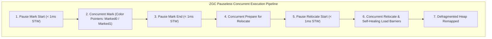

import { ZgcVisualizer } from '../../components/visualizers/ZgcVisualizer';
import { TabbedCodeBlock } from '../../components/ui/TabbedCodeBlock';
import { Callout } from '../../components/ui/Callout';

export const gcSnippets = {
  java: {
    label: 'Java (ZGC Flags)',
    ext: 'sh',
    lang: 'bash',
    filename: 'zgc_config.sh',
    code: `# Launch JVM with Generational ZGC & Sub-Millisecond Pause SLA
java -XX:+UseZGC \\
     -XX:+ZGenerational \\
     -Xms16g -Xmx64g \\
     -XX:ZAllocationSpikeTolerance=5 \\
     -jar high_frequency_trading.jar`
  },
  cpp: {
    label: 'C++ (Load Barrier Pseudo)',
    ext: 'cpp',
    lang: 'cpp',
    filename: 'load_barrier.cpp',
    code: `// ZGC JIT-Injected Load Barrier Pseudo-Code
inline zaddress zgc_load_barrier(zaddress* ref_addr) {
    zaddress ref = *ref_addr;
    // Check if colored pointer bit indicates bad color (un-relocated)
    if (is_bad_color(ref)) {
        // Slow path: resolve forwarding table & self-heal reference
        return zgc_relocate_or_remap(ref_addr, ref);
    }
    return ref; // Fast path: 1 CPU cycle
}`
  }
};

In traditional tracing garbage collectors (such as Parallel GC or G1GC), compacting live objects to defragment the heap requires freezing all application worker threads during a **Stop-The-World (STW)** pause. On multi-gigabyte or terabyte heaps, STW pauses can last hundreds of milliseconds or even seconds, causing severe SLA breaches in financial trading engines and web services.

Modern production garbage collectors  -  specifically **ZGC** (*JEP 377 / JEP 439*) and **Shenandoah** (*JEP 379*)  -  achieve **sub-millisecond maximum STW pause times** regardless of heap size (from 16MB up to 16TB).

---

## 1. Summary & Key Architectural Takeaways

- **Colored Pointers**: Metadata bits stored directly inside 64-bit reference pointers (`Marked0`, `Marked1`, `Remapped`).
- **Load Barriers**: JIT-injected micro-checks that self-heal stale object pointers during field reads without stopping application threads.
- **Concurrent Compaction**: Object relocation happens concurrently while worker threads execute.

---

## 2. Interactive ZGC Pauseless Collector Simulator

Test how ZGC advances concurrent marking and load-barrier object relocation below:

<ZgcVisualizer client:load />

---

## 3. ZGC Concurrent Execution & Colored Pointer Pipeline

---

## 4. Multi-Language Configuration & Load Barrier Code

<TabbedCodeBlock client:load title="ZGC Execution Configuration & Load Barrier" snippets={gcSnippets} defaultFilenamePrefix="zgc_engine" />

---

## 5. Engineering Guidance

1. **Max Pause SLA**: ZGC guarantees max STW pauses $<1\text{ms}$ on JDK 21+.
2. **Generational ZGC**: JDK 21 introduced generational collection, separating young and old objects to achieve up to $4\times$ higher throughput!
